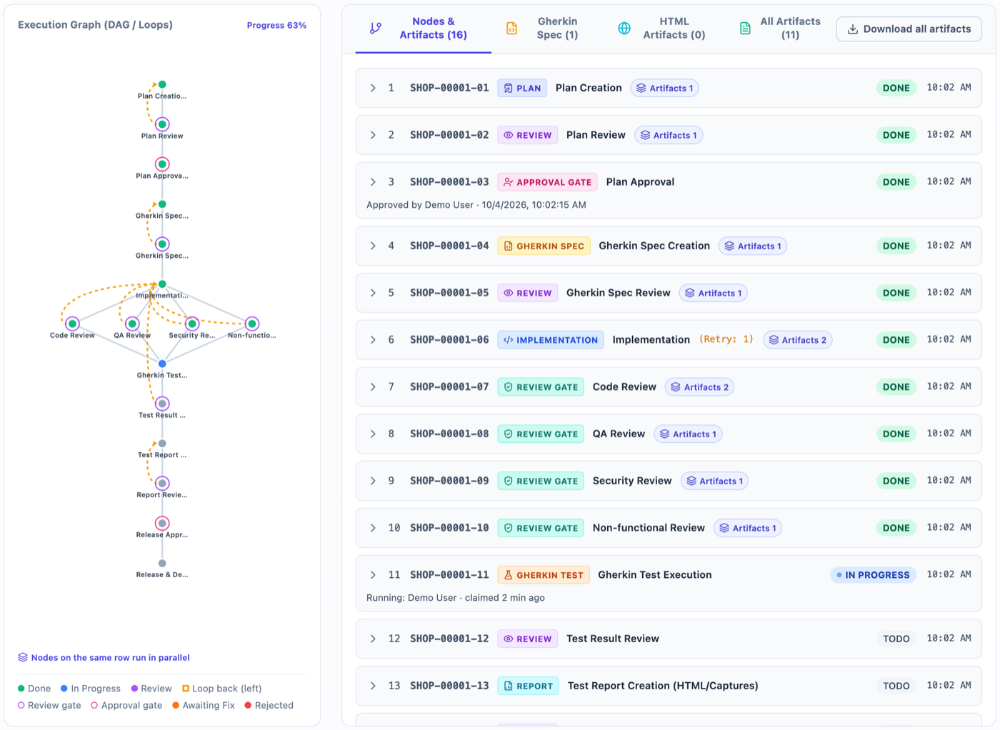
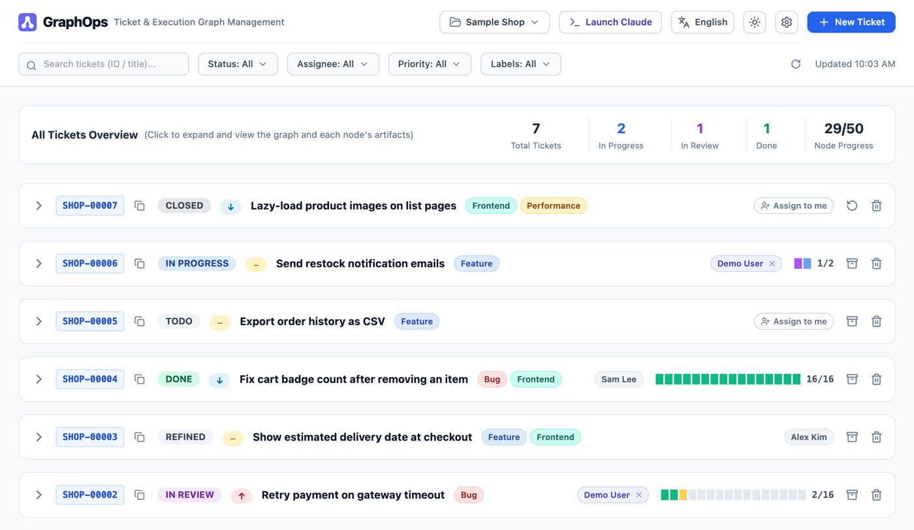
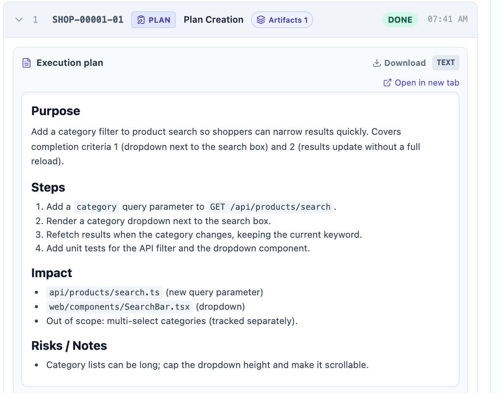
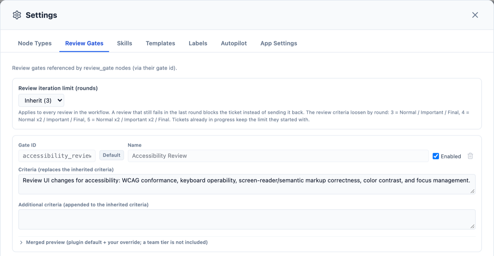

# GraphOps

[English](README.md) | 日本語

GraphOps は、実行グラフ（DAG／並列／ループ）を軸にした、AI 駆動開発向けのチケット管理・実行基盤です。Claude Code のプラグインとしてインストールし、スラッシュコマンドとローカルの Web UI で操作します。手元でのビルドは不要です。



> この README のスクリーンショットは、サンプルデータを使った英語表示の Web UI です。本文の画面名やボタン名は、日本語表示のときの文言で書いています。UI の表示言語（English／日本語）はヘッダーから切り替えられます。

## GraphOps でできること

- **チケットごとの実行グラフ**: チケットごとに、`plan`／`investigation`／`review`／`gherkin_spec`／`implementation`／`review_gate`／`gherkin_test`／`documentation`／`approval_gate`／`report`／`release` などのノードから成る DAG を持ちます。グラフの形は、`/graph-ops:process-ticket` がチケットの内容から決めます（調査だけ、Gherkin テスト付きの実装など）。ノードは依存関係に従って直列・並列に実行されます。レビューに落ちると、手直しが必要なノードへ差し戻し（ループ）ます。
- **レビューゲートと承認ゲート**: `review_gate` ノードは、設定した観点（コード、QA、セキュリティ、非機能など）で自動的に合否を判定します。`approval_gate` ノードは、必ず人間の判断を待ちます。判断は、`/graph-ops:process-ticket` を実行中のターミナルでも Web UI でもできます。
- **Web UI**: 検索・フィルタ（ステータス・担当者・優先度・ラベル）・ページングに対応したチケット一覧、チケットごとの実行グラフのインタラクティブな表示、すべての成果物（Markdown／Gherkin／HTML）の整形プレビュー、承認・却下ボタン、Claude Code を起動するボタンを備えています。
- **オートパイロット**: `/graph-ops:autopilot-ticket` は 1 つのチケットを、リファインからリリースまで人に確認せずに進めます。`/graph-ops:autopilot-tree` は、あるチケットとそこから派生したすべてのチケットを 1 件ずつ同じように進めます。チケットごとに別のターミナルと git ブランチで作業し、子の成果は親のブランチへマージされます（詳しくは「[オートパイロット](#オートパイロット)」の節）。
- **プラグインを編集せずにカスタマイズ**: ノード種別ごとの指示、レビューゲートの観点、スキルへの指示、計画・レビュー・レポートのテンプレートを拡張できます。自分用の設定は Web UI の設定画面から編集し、チームで共有したい場合は、アプリ設定の「チーム設定ディレクトリ」（`teamExtensionsDir`）で共有ディレクトリを指定します（詳しくは「[設定](#設定)」の節）。
- **データ保存先を選べる**: 既定はローカルの SQLite ファイルです。チームでプロジェクトやチケットを共有するなら MySQL、Jira などの自前のシステムにデータを置くなら HTTP カスタムデータソースを使えます。

## 必要なもの

- [Claude Code](https://docs.claude.com/en/docs/claude-code)
- `PATH` 上の `git` と `node`、および初回インストール時のネットワーク接続（Claude Code がプラグインを `git` で取得し、プラグインは初回利用時に `node` で `graph-engine` バイナリをダウンロードします）
- macOS（Apple シリコン／Intel）、Linux（x86_64）、Windows（x86_64）
- MySQL バックエンドを使い、サーバーでバイナリログが有効（`log_bin` が `ON`）な場合: `binlog_format` が `ROW`（MySQL 8.0 以降の既定）か `MIXED` であること。GraphOps は MySQL ではチケットのグラフの一括作成（最初の `get-executable` での seed 作成と `expand-graph`）を READ COMMITTED のトランザクションで行うため、`binlog_format=STATEMENT` のサーバーでは MySQL が Error 1665 で拒否します。`SELECT @@global.binlog_format, @@global.log_bin;` で確認できます。バイナリログが無効なサーバーは影響を受けません。

## インストールと使い始め方

### インストール

Claude Code 内で次を実行します。
```
/plugin marketplace add imahiro-t/graph-ops
/plugin install graph-ops@graph-ops
```
インストールすると、現在のリリースタグのプラグインが取得されます。プラグインが初めて `graph-engine` を実行するときに、お使いの OS／アーキテクチャ向けのバイナリをそのリリースの GitHub Release からダウンロードし、リリースの `checksums.txt` と照合してから、ユーザーごとのキャッシュ（`~/.cache/graph-ops/engine/`。Windows では `%LOCALAPPDATA%\graph-ops\engine`）に保存します。2 回目以降はこのキャッシュを使います。

### クイックスタート

1. **プラグインの言語を選ぶ**: `/graph-ops:onboarding` を一度実行します。ノード名や生成される内容（計画、Gherkin 仕様、実装メモ、レビュー結果、レポート）に使う言語を聞かれます。いつでも再実行できます。
2. **プロジェクトを登録する**: プロジェクトの作業ディレクトリに `cd` して Claude Code を起動し、`/graph-ops:ui` を実行します。ブラウザで Web UI が開きます。自分の環境でそのディレクトリに対応するプロジェクトがまだなければ、ダイアログで「**新規作成**」するか、DB にある「**既存プロジェクトから選ぶ**」（同じ MySQL を使うメンバーがすでに作ったプロジェクトなど）を選べます。どちらを選んでも、そのディレクトリとプロジェクトの対応が自分の `$HOME/.graph-ops/config.json` に保存されます。
3. **チケットを作る**: `/graph-ops:create-ticket` を実行し、やりたいことを伝えます。Claude が範囲・影響箇所・エッジケースなどを対話で詰めてから、チケットを登録します。Web UI の「新規チケット」ボタンから始めることもできます。
4. **チケットをリファインする（任意）**: `/graph-ops:refine-ticket` を実行すると、完了条件と「なぜやるか」を固め、その内容でチケットの説明を書き直します。
5. **チケットを実行する**: `/graph-ops:process-ticket` を実行します（Web UI のチケットの「実行する」ボタンでも可）。実行グラフを組み立て、ノードごとにサブエージェントで（可能なところは並列に）作業し、成果物を保存し、レビューが通るまで繰り返します。
6. **Web UI で進捗を確認する**: `/graph-ops:ui` でいつでも開けます。グラフの確認、成果物の閲覧、承認ゲートの承認・却下ができます。

### 新しいリリースへの更新

`/plugin` メニューから更新するか、ターミナルで次を実行します。
```sh
claude plugin update graph-ops@graph-ops
```
リリースのたびにマーケットプレイスの登録内容が新しいリリースタグを指すので、更新するとそのリリースが取得されます。更新後の初回実行時に、対応する `graph-engine` バイナリがダウンロードされ、ほかのバージョンのバイナリはキャッシュから削除されます。アンインストールや再インストールは不要です。

ただし、すでに起動している UI サーバーの再起動だけは、更新では行われません。`/graph-ops:ui` は、ポートで応答するサーバーがあればバージョンを確かめずにそのまま使い、サーバーは停止するまで動き続けるので、更新前に起動したサーバーが旧版のまま使われ続けます。旧版のサーバーも、保存するとき（プロジェクトの切り替えやアプリ設定の保存）には `$HOME/.graph-ops/config.json` を書き直します。0.9.0 以前のサーバーは、その版が知らない設定（0.10.0 で追加された `autopilotSettings` など）をこのファイルから消してしまいます。0.10.0 以降は、保存しても自分の版が知らない設定を残しますが、0.9.0 以前のサーバーは残さないので、更新後はすぐに UI サーバーを再起動してください。更新後は次のようにしてください。
- **更新前に起動した UI サーバーが動いていれば停止する**: macOS／Linux では、既定のポートなら `kill $(lsof -ti tcp:49173 -sTCP:LISTEN)` で停止できます（`port`／`PORT` を変えている場合は、その番号に置き換えてください）。ほかの OS では、既定のポート 49173（または設定したポート）で待ち受けているプロセスを停止してください。
- **そのあと、更新後に起動した Claude Code のセッションで `/graph-ops:ui` を実行して**、新しい版のサーバーを起動します。更新時にすでに開いていたセッションは旧版の `graph-engine` を実行し続けることがあり、その場合は旧版のサーバーがまた起動してしまうので、先に、更新時に開いていた Claude Code のセッションをすべて再起動する（または新しいセッションを開始する）ようにしてください。`/plugin` メニューから更新した場合も、ターミナルから更新した場合も同じです。リリースによっては、UI サーバーを再起動しないと正しく動きません。旧版のサーバーが動いたままだと何が起きるかは、[0.7.0 のリリースノート](docs/release-notes/v0.7.0.md#upgrade-notes)（英語）を参照してください。
- **バージョン 0.4.0 以前をインストールしていた場合**: これらのバージョンは `node` のワンライナーで取得され、リリースごとにリポジトリのクローンを `~/.cache/graph-ops/` の下（例: `~/.cache/graph-ops/v0.4.0`）に残していました。現在のプラグインはこれらを使わないので、そこにある `v*` ディレクトリは削除してかまいません。ダウンロード済みのバイナリが入っている `~/.cache/graph-ops/engine/` は残してください。

## コマンド一覧

| コマンド | 役割 |
| --- | --- |
| `/graph-ops:onboarding` | 初回セットアップ。プラグインが使う言語を確認し、設定として保存します。 |
| `/graph-ops:create-ticket` | 依頼内容を対話で詰めてから、チケットを作成します。プロジェクトの既存ラベルから合うものを提案し、合うものがなければ新しいラベルを提案して、承認を得てから登録します。実行グラフは作りません。 |
| `/graph-ops:refine-ticket` | チケットの完了条件と「なぜやるか」を固め、説明を書き直します（必要なら優先度とラベルも変更します。ラベルは既存のものから提案し、新しいラベルは承認を得てから登録します）。実行グラフは作りません。 |
| `/graph-ops:process-ticket <ticketId> [--model <m>]` | チケットの実行グラフの形を決め、サブエージェントで実行します。成果物の保存と、レビューが収束するまでの繰り返しも行います。各ノードはノード種別のモデルで動き、`--model` がその上限になります（「[ノード種別ごとのモデルとモデル上限](#ノード種別ごとのモデルとモデル上限)」を参照）。 |
| `/graph-ops:autopilot-ticket <ticketId> [--model <m>]` | チケットのリファイン、実行グラフの実行、リリース、申し送りのチケット化までを、人の入力なしで進めます。作業は別ターミナルの子セッションが行い、起動したセッションは中継と短い結果の保持だけを行います。「[オートパイロット](#オートパイロット)」を参照してください。 |
| `/graph-ops:autopilot-tree <ticketId> [--model <m>]` | 同じことを、そのチケットと、その子孫のチケット（途中で作られたものを含む）に 1 件ずつ行います。子のブランチは親のブランチへマージされ、最後にツリー全体のサマリを出力します。 |
| `/graph-ops:ui` | カレントディレクトリがローカルパス（またはその配下）にあたるプロジェクトのローカル Web UI を開きます。必要なら UI サーバーを起動します。該当がなければ、このディレクトリ用にプロジェクトを新規作成するか既存プロジェクトを選べます。 |

## ノード種別ごとのモデルとモデル上限

`process-ticket` はノードごとにサブエージェントを起動しますが、すべてのノードに最上位のモデルが要るわけではありません。ノード種別ごとにモデルを割り当て、起動時に選んだモデルをそのチケット全体の**上限**として扱います。

**既定の割り当て。** 上位より下のモデルにするのは、次の 3 つをすべて満たすノード種別だけです。入力が前段ノードの成果物や固定テンプレートで決まっていて、設計・方針・合否をノード自身が判断しない（判断は前段のレビューやゲートで済んでいる）。手順が固定されている（決められたコマンドの実行、結果の転記、テンプレートの穴埋め）。失敗しても後段のレビューや `add-artifact` の構造検査で検出でき、品質判定の最後の砦ではない。このうち、テンプレートへの転記だけで済むものを `haiku`、手順は固定でも実行結果の読み取りや外部への操作（テスト失敗の原因の切り分け、git やプルリクエストの操作）を伴うものを `sonnet` にしています。

| ノード種別 | モデル | 理由 |
| --- | --- | --- |
| `report` | `haiku` | テスト結果を固定の HTML テンプレートに転記するだけです。構造は `add-artifact` が検査し、後段に `report_review` があります。 |
| `gherkin_test` | `sonnet` | 確定したシナリオを実行・記録する定型作業ですが、実行環境の準備や失敗の読み取りが要ります。後段に `test_review` があります。 |
| `release` | `sonnet` | 承認済みの変更を手順どおりに反映します。git やプルリクエストの操作が失敗したときの対処が要ります。 |
| `plan`・`investigation`・`gherkin_spec`・`implementation`・`review`・`review_gate`・`documentation`・`deliverable`・独自のノード種別 | `inherit`（上位） | 設計・判断・合否判定を担います。 |

`approval_gate` は人（またはオートパイロットの worker セッション自身）が判断するノードで、サブエージェントを起動しないため、モデルはありません。

**割り当ての上書き。** 自分の `$HOME/.graph-ops/config.yaml`、またはチーム層の `workflow.yaml`（「[設定](#設定)」の「チームでの設定の共有」を参照）に `node_models` を書きます。値は `haiku`・`sonnet`・`opus`・`inherit`（小文字）です。キーごとに、プラグインの既定 → 自分の層 → チーム層の順に後のものが勝ちます。独自のノード種別にも指定でき、指定のないノード種別は `inherit` です。不正な値（`fable` や `gpt-4` など）があると `graph-engine` はそのファイルを読み込まずにエラーにし、設定画面は `NODE_MODEL_INVALID` の警告を表示して保存を拒否します。合成後の `node_models` は `graph-engine get-workflow-catalog` で確認できます。たとえばレポートを上位に戻すには次のように書きます。

```yaml
node_models:
  report: inherit
```

**起動時の上限の指定。** `/graph-ops:process-ticket <ticketId>`・`/graph-ops:autopilot-ticket <ticketId>`・`/graph-ops:autopilot-tree <ticketId>` に `--model haiku|sonnet|opus` を付けるか、Web UI の「実行する」の隣、または「オートパイロット」の確認ダイアログにある「モデル上限」で選びます。

- **どのノードも `min(ノード種別の割り当て, 上限)` のモデルで動きます**（`haiku` < `sonnet` < `opus`）。`inherit` のノードは上限そのもので動きます。上限が `haiku` ならすべてのノードが Haiku、`sonnet` なら上位のノードが Sonnet で `report` が Haiku になります。
- **上限は引き継がれます**。セッションから、それが起動するサブエージェントへ（ノードのエージェントがさらにサブエージェントを起動するときも上限以下にします）。オートパイロットでは、子・孫のすべてのセッションが `claude --model <上限>` で起動されます。
- **Web UI から起動すると、起動されるセッション自体が選んだモデルで動きます**（`claude --model <m>`）。オートパイロットのオーケストレーターも同じです。CLI では、すでに動いているセッションは自分のモデルを変えられないため、`--model` の上限はそのセッションが起動するサブエージェントにだけ効きます。
- **上限であって禁止ではありません**。Sonnet のセッションから `--model opus` を指定すると、上位のノードは Opus のサブエージェントで動きます。
- **上限を指定しなければ今と同じ動きです**。`--model` を付けない場合（Web UI では「指定なし」）、起動元のセッション自身のモデルが上限になります。セッション自身と同じモデルファミリーになるノードにはモデルを一切指定せず、版や 1M コンテキスト版などの variant も含めて起動元のモデルをそのまま継承するので、それより低く割り当てられたノード（既定では `report`・`gherkin_test`・`release`）だけが低いモデルで起動されます。
- **セッションのモデル ID からモデルファミリーを判別できない場合は、上限なしとして扱います**。上位のノードは起動元のモデルをそのまま継承し、低く割り当てられたノードは割り当てどおりのモデルで動きます。起動元が Haiku なのに判別できなかったときだけ、`sonnet` のノードが起動元より上位のモデルで動くことがあります。
- **オートパイロットの run は上限を記録します**（`graph-engine autopilot start`・`status`・`worker-context` と run の API の `model_cap`、上限があるときはサマリの `Model cap:` 行）。中断・停止した run を CLI で `--model` なしで再開すると、記録した上限を保ちます。外すには `--model inherit` を指定します。**Web UI からの再開では常に選択欄の値を送り、「指定なし」は `inherit` として送られるため、run に記録された上限は外れます**。再開後も上限を保ちたいときは、確認ダイアログでモデルを選び直してください。選択欄は確認ダイアログを開くたびに「指定なし」に戻ります。

低いモデルでノードが失敗したときに、上位のモデルで自動的にやり直すことはしません。割り当てたモデルでうまく動かないノード種別は、`node_models` で `inherit` にしてください。

## Web UI の使い方

### プロジェクト

ヘッダーのプロジェクトメニューで、登録済みのプロジェクトを切り替えます。「新規プロジェクト...」から別のプロジェクトを登録できます（名前、任意の ID プレフィックス、任意でローカルパスの絶対パス）。チケットとその ID（例: `SHOP-00001`）はプロジェクトに属します。

プロジェクト本体（名前・プレフィックス・チケット）は DB にあり、チームで共有できます。一方、**ローカルパス**（自分のマシン上でプロジェクトがある場所）は環境ごとの設定です。DB ではなく自分の `$HOME/.graph-ops/config.json` の `projectPaths`（プロジェクト ID → 絶対パス）に保存されるので、同じ DB を使うメンバーがそれぞれ自分のパスを設定しても互いに影響しません。ローカルパスは、`/graph-ops:ui` や `create-ticket` がカレントディレクトリと照合する対象（ディレクトリを含むローカルパスのうち一番深いものが優先されるので、プロジェクト配下の git worktree もそのプロジェクトになります）であり、Claude Code を起動するディレクトリです。設定の置き場所ではありません。プロジェクト自身のディレクトリから設定やエージェントへの指示文が読まれることはありません。自分の環境でローカルパスが未設定のプロジェクトも使えます（起動が既定のターミナル用ディレクトリになるだけです）。

**「今どのプロジェクトを見ているか」も環境ごとの設定です。** `projectPaths` と並んで自分の `$HOME/.graph-ops/config.json` の `currentProjectId` に保存され、DB には書かれません。そのため、ヘッダーでプロジェクトを切り替えても、`graph-engine use-project <projectId>` を実行しても、変わるのは**自分**の表示と、`--project` を付けずに `create-ticket` したときの作成先だけです。同じ DB を共有していても、各自の選択は互いに影響しません。チケット一覧は常にヘッダーに表示中のプロジェクトを指定して取得されるので、両者が食い違うことはありません。

### チケット一覧



- 「全チケット概要」に、総チケット数、進行中・レビュー中・完了の件数、ノード進捗が表示されます。
- チケット ID やタイトルで検索し、ステータス・担当者・優先度・ラベルで絞り込み、ページを切り替えられます。一覧は 15 秒ごとに自動で更新されます。「○○ 更新」の時刻の横にある更新ボタンで、すぐに最新の状態にできます。
- 4つの絞り込みはどれも同じ操作です。何も選んでいない状態が「すべて」（絞り込みなし）で、同じ絞り込みの中で複数選ぶと、そのいずれかに一致するチケットが表示されます。異なる絞り込みどうしは、すべてに一致するチケットに絞られます。パネル下部の「選択を解除」を押すと、その絞り込みの選択が空（＝すべて）に戻ります。隣の「すべて選択」を押すと、その絞り込みの全項目（担当者の「未割り当て」を含む）にチェックが入り、パネルは開いたままなので、続けて不要な項目だけ外せます（例: 「完了」と「クローズ」以外のステータスを表示する）。全項目がチェック済みのときは「すべて選択」は押せません。全項目を選んだ状態は「◯件選択」と表示され、「すべて」とは表示されません。未選択（絞り込みなし）とは同じにならない場合があるためで、ラベルではラベルの付いていないチケットが除外され、担当者では後から現れた担当者は含まれません。担当者も複数選べ、「未割り当て」を選ぶと担当者が未設定のチケットだけに絞り込めます。
- チケットのステータス（`TODO`／`REFINED`／`IN PROGRESS`／`IN REVIEW`／`IN RELEASE`／`DONE`／`CLOSED`。日本語表示ではそれぞれ「未着手」「リファイン済み」「進行中」「レビュー中」「リリース中」「完了」「クローズ」）は、実行グラフから自動的に決まります。
- チケットの優先度の変更、「担当する」での自分への割り当て、完了せずにクローズ（理由は任意）、再オープン、削除（確認あり）ができます。
- 「担当する」ボタンは、設定 > アプリ設定 > 「自分の情報」で名前を設定すると表示されます。
- チケットには複数のラベル（「バグ」「機能追加」など）を付けられ、チケットの行と展開したチケットに色付きで表示されます。付け外しは、展開したチケットの「ラベルを編集」で行います。選べるのは、そのプロジェクトに登録済みのラベル（設定の「ラベル」を参照）だけです。

### 実行グラフと成果物

チケットをクリックすると展開されます。左側は実行グラフです。同じ行のノードは並列に実行され、破線は手直しのための差し戻し辺、リングはレビューゲートと承認ゲートを表します。右側にはノードの一覧が、ステータスと再実行回数とともに表示されます。



- ノードをクリックすると成果物をプレビューできます。Markdown・Gherkin・HTML は整形して表示されます。
- 成果物ごとに「別タブで開く」「ダウンロード」ができます。「成果物を一括ダウンロード」で、チケットのすべての成果物を zip でまとめてダウンロードできます。zip にはチケットの説明（`00_チケット説明.md`）と、実行順に番号を付けたノードごとのフォルダ（`01_<ノード名>`、`02_<ノード名>`…）が入ります。
- 「ノード一覧・成果物展開」（上記のノード一覧）のほか、「Gherkin 仕様」「HTML成果物」「全成果物」タブには、チケット全体の成果物が種類ごとにまとまっています。
- 別のチケットから派生したチケットには「親チケット」へのリンクが、派生したチケットを持つチケットには「子チケット（n件）」の一覧が、各チケットのステータス付きで表示されます。クリックするとそのチケットを開きます（一覧の絞り込みで隠れている場合は絞り込みを解除します）。親はチケットの作成時に決まり（`graph-engine create-ticket --parent <ticketId>`、またはオートパイロットによる作成）、後から変えることはできません。
- オートパイロットで処理したチケットには「自動判断（n件）」の欄も表示されます。人の代わりに行った判断（リファイン、承認ゲート、反復上限、リリース、申し送りのチケット化、ツリーのサマリ）が並び、それぞれ別タブで開けます。

### 承認と却下

チケットが承認待ちの `approval_gate` に達したら、チケットを開きます。そのノードの行に「承認」「却下」ボタンが表示されます。却下には理由の入力が必要です。判断した後は、その行に誰がいつ判断したか（「承認: <名前> · <日時>」）が表示されます。別のメンバーが先に同じゲートを判断していた場合、あなたの判断は拒否され、何も保存されません（補足の「複数のメンバーで同じチケットを扱う場合：承認と判断者の記録」を参照）。

ターミナルで回答することもできます。`/graph-ops:process-ticket` はゲートに達すると、何を承認するのかを伝え、ゲートを見張る `graph-engine wait-node` をバックグラウンドで起動して、ターンを終えます。そのターミナルで承認か却下（理由付き）を答えるか、Web UI のボタンを使います。Web UI で判断すると、待機中のセッションが自動で再開します。承認ならグラフの実行を続けます。却下なら process-ticket が却下理由を読み、手直しが必要なノードを再開します（要件から考え直す必要がある理由なら、ユーザーに報告します）。

ゲートで待機中の process-ticket セッションがない場合（ターミナルを閉じた場合など）、Web UI での判断は記録されるだけです。次にそのチケットで `/graph-ops:process-ticket` を実行したときに、グラフの実行が続くか、却下が処理されます。それまで、却下されたチケットは、人が解決しない限りブロックされたままです。

### Claude Code の起動

次のボタンは、`claude` を実行する外部の対話型ターミナルを開きます。権限の確認やその後のやり取りは、そのターミナルで行います。

- ヘッダーの「Claude 起動」は、任意のプロンプトを入力して「起動」を押すダイアログを開きます。
- ヘッダーの「新規チケット」は、作成したいチケットの内容を書く入力欄 1 つのフォームを開きます。「作成」を押すと `claude` が起動し、create-ticket スキルでタイトルと説明を考え、確認を取ってからチケットを登録します。
- 展開したチケットの「リファイン」「実行する」は、そのチケットのリファインや実行のために `claude` を起動します。「実行する」の隣の「モデル上限」で選ぶと、そのモデルでセッションを起動し、process-ticket に `--model` として渡します（「[ノード種別ごとのモデルとモデル上限](#ノード種別ごとのモデルとモデル上限)」を参照）。「指定なし」なら従来どおり `claude` を起動します。「リファイン」とプロンプト欄は、モデルを指定せずに起動します。
- 展開したチケットのアクション行の右端（「リファイン」「実行する」とは別枠）にある「オートパイロット」は、確認のあと、そのチケットでオートパイロットを起動します。確認ダイアログで「ツリー（このチケットと子孫）」（初期選択）か「このチケット単体」かと、run の「モデル上限」を選びます（「[オートパイロット](#オートパイロット)」を参照）。ほかのボタンと違い、起動後は人の操作なしで進みます。ターミナルはプロジェクトのオートパイロット設定の権限モードで開かれ、チケットごとの作業はさらに別のターミナルで行われます。プロジェクトのローカルパスが必要です。
- 展開したチケットのプロンプト欄からは、そのチケットに関する任意の指示を「送信」で送れます。

プロンプト欄は複数行に対応しています。Enter で改行し、「起動」／「送信」／「作成」ボタンか、Cmd+Enter（macOS）／Ctrl+Enter で送信します。空白や空行だけのプロンプトは送信されません。

### 設定



ヘッダーの歯車ボタンで設定画面を開きます。

- **設定の置き場所**: ここでの設定は自分のもので、すべてのプロジェクトに適用されます。「オートパイロット」タブとプロジェクト管理を除き、プロジェクト単位のスコープはありません。この画面で編集した内容は自分の設定ディレクトリ `$HOME/.graph-ops` に書き込まれます（`config.json` の `userExtensionsDir` と環境変数 `GRAPH_USER_EXTENSIONS_DIR` で場所を変えることはできますが、手での編集か環境変数によるものだけです。Web UI では編集せず、アプリ設定を保存しても `config.json` にある値はそのまま残ります）。どれも普通のファイル（レビューゲートと言語は `config.yaml`、指示とテンプレートは `extensions/` の下）なので、手で編集することもできます。この画面が編集するのは自分の層だけです。共有ディレクトリの内容は、そのファイルがある場所で編集してください。
- **チームでの設定の共有（チーム層）**: アプリ設定の「チーム設定ディレクトリ」に、共有ディレクトリを絶対パスで指定します（`$HOME/.graph-ops/config.json` の `teamExtensionsDir` として保存されます。環境変数 `GRAPH_TEAM_EXTENSIONS_DIR` が設定されている場合はそちらが優先され、変更は `graph-engine` の CLI には（したがって、コマンドのたびに `config.json` を読み直すエージェントにも）すぐに反映され、すでに起動している UI サーバーには再起動後に反映されます）。共有ディレクトリの構成は自分の設定ディレクトリと同じですが、チーム層のレビューゲートはルートの `config.yaml` ではなく `workflow.yaml` に書きます（`extensions/` 配下の構成は自分の層とまったく同じです）。指定すると、その内容が**自分の設定より優先される**チーム層として読まれます。未設定の場合や、自分の設定ディレクトリと同じ場所を指定した場合はチーム層はなく、自分の設定だけが使われます。既定値はないので、自分で指定しないかぎりチーム層は存在しません。とくに、作業中のリポジトリの中にある `.graph-ops/` ディレクトリが読まれることはありません。
  - **チーム層で設定できるもの**: ローカルファイルで設定する項目のうち、個人のものではない項目です。ノード種別の指示、ワークフローの設定（`workflow.yaml` のレビューゲート、レビュー反復上限、ノード種別ごとのモデル（`node_models`））、実行計画・レビュー・レポートのテンプレート、スキルへの指示、オートパイロット設定（`autopilot.yaml`。「[オートパイロットの設定](#オートパイロットの設定)」を参照）。
  - **チーム層で設定できないもの**: DB に保存する設定（ラベルなど）と、自分や自分の環境に固有の設定です。DB 接続、各プロジェクトのローカルパス、自分の名前（`myName`）、現在のプロジェクト、言語。これらはチーム層からは読まれません。
  - **言語は個人の設定です。** 作業言語（`/graph-ops:onboarding` が設定する、自分の `config.yaml` の `language`）は、自分の層と明示的な `--language` の指定だけで決まります。チーム層の `workflow.yaml` にある `language` は無視され、`graph-engine` は見つけると、stderr に `graph-ops: warning: team workflow.yaml sets language "ja", which is ignored: the working language is a personal setting (...)` のような 1 行の警告を出します。JSON 出力と終了コードは変わりません（`get-language-settings` の `source` は `"user"` か `"none"` で、`"team"` にはなりません）。ここでいう言語の設定は、`language` の項目と、`/graph-ops:onboarding` が自分の `extensions/` 配下の指示ファイルに書き込む言語のブロックのことです。チーム層の指示ファイル（`extensions/node-types/*.md` など）の内容をエンジンは制限しないので、そこに言語の指示を書けば、成果物の言語に影響することはあります。
- **ノード種別／レビューゲート／スキル／テンプレート**: ノード種別ごとの指示の追加（独自のノード種別の追加も可）、レビューゲートの観点の変更・追加（有効・無効も含む）、ワークフロー全体のレビュー反復上限（3・4・5 巡のいずれか。既定は 3。最後の巡回でも不合格ならチケットをブロックします。収束基準は巡回に応じて「通常 → 重要 → 最終」と緩みます）の設定、スキルごとの指示の追加、実行計画・レビュー・HTML レポートのテンプレートの差し替え（「テンプレート」タブの左の一覧で 3 つを切り替えます）ができます。どの画面にも、プラグインの既定と自分の層を合成したプレビューがあります。共有ディレクトリ（チーム層）を設定している場合、その内容はこのプレビューには含まれません。合成後の内容は `graph-engine get-node-type-context <nodeType>` で確認できます。
- **オートパイロット**: プロジェクトのオートパイロット設定です（「[オートパイロットの設定](#オートパイロットの設定)」を参照）。ラベルタブと同じく、このタブは独自のプロジェクト選択を持っていて、どのプロジェクトのオートパイロット設定でも編集できます。タブを開くたびにヘッダーで選んでいるプロジェクト（未選択なら先頭のプロジェクト）から始まります。プロジェクトが 1 つもないときは、プロジェクト選択だけが無効になります。タブ自体は開けますが、設定フォームは表示されず、プロジェクトがまだないことを示すメッセージが表示されます。プロジェクトを切り替えるとそのプロジェクトの設定を読み込み（読み込みが終わるまでは読み込み中と表示します）、保存はその時点で選んでいるプロジェクトに対して行われます。未保存の変更があるときに切り替えようとすると、タブを切り替えるときと同じ破棄の確認が表示され、キャンセルすれば元のプロジェクトと編集内容のまま残ります。`config.yaml` ではなく `$HOME/.graph-ops/config.json` に保存されます。チームの `autopilot.yaml` で固定された項目は、出所とともに読み取り専用で表示されます。「ローカル値を削除して既定値に戻す」で、その項目の自分の値を削除できます。
- **ラベル**: ラベルの作成、名前の変更、固定パレットからの色の選択、削除ができます。ラベルはプロジェクトに属するので、このタブは独自のプロジェクト選択を持っていて、ヘッダーで選んでいるプロジェクトに関係なく、どのプロジェクトのラベルでも編集できます。ラベル名はプロジェクト内で重複できません（大文字小文字は区別しません）。ラベルは DB に保存されるので、変更はすぐに保存されて同じ DB を使う全員で共有され、そのラベルが付いたすべてのチケットの表示に反映されます。このタブはプロジェクトのローカルパスが未設定でも使えます。使用中のラベルを削除するときは、使用しているチケットの件数付きで確認が表示され、確定するとすべてのチケットから外れます。CLI（`graph-engine create-ticket`／`refine-ticket` の `--label <name>`）で付けられるのは登録済みのラベルだけです。ラベルの一覧は `graph-engine list-labels`、新規登録は `graph-engine create-label` で CLI からもできますが、名前の変更と削除はこのタブでのみ行います。
- **アプリ設定**: データ保存先（SQLite のデータベースファイル、TLS 設定を含む MySQL 接続、または HTTP カスタムデータソース）、「自分の情報」（「担当する」に使う名前）、1 ページあたりのチケット数、チーム設定ディレクトリ（上の「チームでの設定の共有」を参照。空欄ならチーム層なし。絶対パスで指定します）、プロジェクト管理（名前の変更、この環境でのローカルパスの確認・設定・変更・クリア（未設定なら「未設定」と表示）、削除）。この画面の項目はすべて、GraphOps が設定を読む唯一のファイル `$HOME/.graph-ops/config.json` から読み込まれ、同じファイルに保存されます（保存ボタンの横にそのファイル名が表示されます）。保存先の変更は、次にサーバーを起動したときに反映されます。既定値のままで動くので、ほとんどの場合は変更不要です。
  - `PUT /api/settings/app` を使う他のクライアント向けの注意: `PUT` はこの画面が扱う項目を置き換えるので、ボディに含めなかった項目は消えます。例外は `teamExtensionsDir` だけで、省略した場合（または `null`）は保存済みの値が残り、明示的に `""`（または空白のみ）を送ったときだけ削除されます。この項目ができる前に書かれたクライアントが、手で設定したチーム設定ディレクトリを黙って消さないようにするためです。相対パスは `400 VALIDATION_ERROR` で拒否され、何も保存されません。`userExtensionsDir` は `PUT` では保存されなくなりました（ボディに含めても無視されます）。`GET` は、有効なチーム設定ディレクトリを `effective.teamExtensionsDir` で返します（チーム層がなければ `""`）。

### テーマと言語

ヘッダーのボタンで、テーマ（ライト／ダーク／システム設定に合わせる）と Web UI の表示言語（English／日本語）を切り替えます。

### 対応する画面の大きさ

Web UI は、幅 320 CSS px まで、文字サイズ 200% までの表示に対応しています（WCAG 1.4.10 リフロー）。それより狭い幅や大きい文字サイズには対応しておらず、その条件でだけ起きる表示の崩れは修正しません。

## オートパイロット

オートパイロットは、refine-ticket → process-ticket の流れを、人の判断を待たずに最後まで進めます。`graph-engine autopilot` の CLI とその出力、エラーコード、HTTP API を含む詳細は、[オートパイロットのリファレンス](docs/autopilot.md)（英語）を参照してください。

- **起動**: Claude Code をプロジェクトのディレクトリで開き、1 件なら `/graph-ops:autopilot-ticket <ticketId>`、チケットとその子孫すべてなら `/graph-ops:autopilot-tree <ticketId>` を実行します。Web UI では、展開したチケットの「オートパイロット」を押し、確認ダイアログでツリーかこのチケット単体かを選んで起動できます。プロジェクトのローカルパスが必要です（未設定なら `PROJECT_LOCAL_PATH_NOT_SET`）。
- **動き方**: 起動したセッション（オーケストレーター）は、チケットの作業を自分では行いません。チケットごとに `graph-engine` が新しいターミナルで Claude Code の子セッションを開きます。子セッションは、チケットのリファイン（未リファインの場合）、実行グラフの実行、承認ゲートの判断、リリース、申し送りをチケットにするかどうかの判断（作るチケットはそのチケットの子になります）を行い、3 行以内の要約を報告します。オーケストレーターが持つのはこの要約だけなので、20 件以上のツリーでも 1 つのセッションで処理でき、最後にツリー全体のサマリを出力します。チケットは深さ優先で 1 件ずつ処理します。
- **人の代わりに判断した内容**は、理由とともに `autopilot-decision-*` という成果物としてチケットに保存され、チケットの「自動判断」欄で確認できます。
- **処理するチケット**: ツリーの処理では、`DONE`／`CLOSED` のチケットは飛ばし（その子は処理します）、ほかで進行中のチケットはその下の部分木ごと飛ばします。`maxTickets`／`maxDepth` に達したところで止まります。起点に指定したチケットは必ず処理します。`DONE`／`CLOSED` のチケットから新しい実行は始められません。実行中に作られたチケットも処理の対象になります。
- **Web UI での進捗表示**: 実行の起点に「オートパイロット実行中」、作業中のチケットに「処理中」、判断を待っているセッションに「人の判断待ち」、これから処理するチケットに「待機中」のバッジが付きます。実行中の run が受け持つチケットでは「オートパイロット」ボタンが無効になり、同じツリーを二重に起動できません（CLI からも `AUTOPILOT_ALREADY_RUNNING` で拒否されます）。別のプロジェクトの実行とは互いに干渉しません。
- **複数のメンバーで同じ DB を使う場合**: 二重起動の防止は、同じ DB（MySQL、共有した SQLite ファイル、またはプロトコル 1.2 以上のプラグインの HTTP データソース。Jira サンプルは 1.1 のため対象外）を使う他のメンバーの実行にも効きます。Web UI には誰が実行中か（「<名前> が実行中」）が表示され、拒否のエラーにもその名前が出ます。中断した実行を再開できるのは、起動したマシンだけです。git のブランチは共有されません。先に回す人は `mainReflection` を `pull_request` か `merge` にして成果を反映し、後から回す人はローカルの既定ブランチをリモートに合わせてから起動してください（詳しくは [オートパイロットのリファレンス](docs/autopilot.md#runs-shared-between-members)）。
- **中断したら**: 同じコマンドを再実行する（または同じボタンを押す）と、止まったところから続きます。残りの作業は DB から計算し直します。先に、中断した実行の子ターミナルが残っていれば閉じてください。失敗で停止した実行も、原因を取り除いてから同じ方法で再開でき、失敗したチケットは 1 回だけ再実行されます。

### ブランチ戦略

- 各チケットは、worktree `<ローカルパス>/.claude/worktrees/<ticketId>`、ブランチ `worktree-<ticketId>` で作業します。Claude Code の `EnterWorktree` と同じ命名なので、あとから自分で入れます。
- 単一のチケットとツリーの起点は、既定ブランチ（`origin/HEAD` が指すブランチ。取れなければ `main`）から分岐します。ツリー内の子は、親のブランチから分岐します。
- 子が完了すると、親のブランチを取り込み、コンフリクトを解消し、テストを再実行してから、親のブランチを fast-forward で進めます（承認なし）。部分木がすべて完了した時点で、その部分木の先頭のチケットを親のブランチへもう一度 fast-forward します（帰りがけの merge-up）。これにより、どの深さでも、完了した子孫の成果がすべて起点のブランチに入ります。fast-forward できない場合は、別のマージ用セッションがマージします。解消できないコンフリクトは、そのチケットをブロックにします。
- main へ反映するのは起点だけで、方法は `mainReflection` に従います。`branch` はブランチを残すだけ（既定）、`pull_request` は push して PR を作成、`merge` はさらにマージまで行います。ツリーの処理では、ツリー全体の merge-up が終わった後に 1 回だけ行います。
- 実行中は、ツリーのブランチを手で動かさないでください。

### オートパイロットの設定

設定はプロジェクト単位です。自分の値は 設定 > オートパイロット で（タブのプロジェクト選択でプロジェクトを選んで）編集し、`$HOME/.graph-ops/config.json` の `autopilotSettings.<projectId>` に保存されます。有効な値は `graph-engine autopilot settings` で確認できます。

| 項目 | 値（太字が既定） | 意味 |
| --- | --- | --- |
| `mainReflection` | **`branch`**／`pull_request`／`merge` | 起点の成果を main へ反映する方法。 |
| `permissionMode` | `acceptEdits`／**`auto`**／`dontAsk`／`bypassPermissions` | 子セッションと、Web UI から起動するオーケストレーターの `--permission-mode`。 |
| `autoApproveGates` | **オン**／オフ | 承認ゲートを自動で判断するか。オフなら子セッションが人の判断を待ちます。 |
| `autoCreateTickets` | **オン**／オフ | 申し送りのチケット化を自動で判断・作成するか。そのチケットの変更が原因のものとルートチケットの目的に必要なものだけを子チケットにし、それ以外に見つかった問題はツリー外の 1 件のバックログチケットにまとめます。オフなら子セッションがどれを作るかを人に尋ねます。 |
| `maxTickets` | 1〜100（**20**） | 1 回の実行で処理するチケット数（起点を含む）。 |
| `maxDepth` | 0〜10（**3**） | 処理する派生の深さ（起点が 0）。 |
| `onFailure` | **`stop`**／`continue` | チケットが失敗・ブロックしたとき、実行全体を止めるか、そのチケットの部分木だけ飛ばして続けるか。 |
| `stallTimeoutMinutes` | 15〜1440（**60**） | 活動（CLI の呼び出し、DB や worktree の変化）がまったく無い状態がこの時間続いた子セッションを、無応答として失敗扱いにします。 |

チームで設定を決める場合は、共有ディレクトリ `teamExtensionsDir` の直下に `autopilot.yaml` を置きます。

```yaml
version: 1
defaults:            # 全プロジェクト共通
  mainReflection: pull_request
projects:
  proj-64195d2b:     # プロジェクト ID
    maxTickets: 10
```

項目ごとに、**チーム設定ファイルの `projects.<projectId>` → その `defaults` → 自分のローカル値 → 組み込みの既定値** の順に、最初に見つかった値を使います。チーム設定ファイルが指定した項目は固定（locked）になり、設定 > オートパイロット では出所とともに読み取り専用で表示されます。固定された項目を含む保存は、全体が拒否されます（`AUTOPILOT_SETTING_LOCKED`）。自分のローカル値は消えずに残り、チームがその項目を指定しなくなると再び有効になります。**`permissionMode: bypassPermissions` はチーム設定ファイルからは受け付けません**（警告を出して無視し、その項目は固定されません）。共有ディレクトリを通じて全員の子セッションが無確認で動くことを防ぐためです。チーム設定の不正な値は、エラーにはせず、警告を出して無視します。

### 使う前に知っておくこと

- **最初の実行の前に、プロジェクトのフォルダを Claude Code で一度開き、ワークスペースの信頼（workspace trust）の確認を承認しておいてください。** Claude Code がまだ信頼していないフォルダでは、オートパイロットが新しいターミナルで開く最初のセッション（Web UI から起動したときはオーケストレーター、それ以外は最初の子セッション）が信頼の確認画面で止まり、人が承認するまで進みません。プロジェクトのフォルダを一度信頼すれば十分で、その下のチケットの worktree（`.claude/worktrees/<ticketId>`）では再確認されません。ただし、リポジトリより上のフォルダを信頼しても足りません。git リポジトリではない作業用フォルダ（`~/dev` など）を信頼していても、その下に clone したリポジトリには別に信頼が必要です。Claude Code がフォルダをまだ信頼していないと `~/.claude.json` から判定できたときは、オートパイロットがそのことを知らせます（スラッシュコマンドでは一行で、Web UI では案内の枠で、`graph-engine autopilot start`／`launch` の出力では `untrusted_folder` として）。この案内で起動が止まることはありません。判定はベストエフォートです。読み取るキーは Claude Code のドキュメントに載っていますが、ファイルの形式は公開されていません。そのため、判定できないとき（ファイルがない・形式が想定と違う、ホームディレクトリ、`CLAUDE_CONFIG_DIR` を設定している、Windows、パスに非 ASCII 文字を含む、など）は何も知らせません。案内が出ないことは、信頼済みであることの証明にはなりません。確認画面で止まってしまったときの対処は、オートパイロットのリファレンスの [Starting a run](docs/autopilot.md#starting-a-run) を参照してください。
- **共有のバックエンド（MySQL・Jira・HTTP）では、ツリーの処理は他人のチケットも自分の権限で実行します。** `autopilot-tree` は、DB 上の未完了の子孫をすべて処理します。他人が作った子チケット（実行中に作られたものも含む）も、自分のマシンで、自分の権限モードで、承認ゲートを自動判断しながら実行されます。子孫を作れる人を信頼できる場合にだけツリーモードを使い、`bypassPermissions` とは併用しないでください。
- **別のマシンで作業中のチケットを起点にしないでください。** ほかで進行中の子孫は飛ばしますが、起点に指定したチケットは `IN PROGRESS` でも飛ばしません。
- **`pull_request`／`merge` を使うときは、子セッションの権限モードで `git push` や `gh pr create`／`gh pr merge` が拒否されないことを確認してください。** 拒否されると、そのチケットは `failed`（`permission_denied`）になるか、できたところまでで止まります。
- **停止した実行は、削除するまで残ります。** 実行の記録は `$HOME/.graph-ops/autopilot/<projectId>/runs/` に置かれます。完了した実行は自動で整理されます（新しい 20 件を残します）。一方、起点とモードごとに最新の、停止または中断した実行は、再開できるように残り続けます。再開しないなら、実行中でないことを確かめてから（`graph-engine autopilot status` で分かります）、その `<runId>.json` を削除してください。読み込めない実行ファイルがあると、そのプロジェクトでは新しい実行が `AUTOPILOT_REGISTRY_CORRUPT` で拒否されます。警告に出るファイルを直すか削除してください。記録のロックは短時間しか保持されず、2 分間更新されなければ引き継がれます。
- **未コミットの変更と未追跡ファイル**: 親の worktree で追跡中のファイルに未コミットの変更があると、親のブランチへの fast-forward は拒否されます（`PARENT_WORKTREE_DIRTY`）。未追跡ファイルは、fast-forward で上書きされるものでない限り、この判定の対象外です。
- **Terminal.app では、子セッションはオーケストレーターのウィンドウのタブとして開きます。** macOS で `terminalCommand` を設定しておらず tmux の外にいるときは、run のすべての子セッションが、深さに関係なく、オーケストレーターが動いている Terminal.app のウィンドウに新しいタブとして開きます。このため Terminal に**アクセシビリティ**と**オートメーション**の許可が必要です（システム設定 > プライバシーとセキュリティ。初回に macOS から確認されることがあります）。また、タブを開くたびに Terminal が最前面に来ます。タブを開けないとき（オーケストレーターのタブが閉じられた、許可がない、`osascript` が失敗またはタイムアウトした、サンドボックスに止められた、Terminal を最前面にできなかった、新しいタブを見分けられなかった）は、従来どおり新しいウィンドウで開き、stderr に `graph-engine: warning:` を出します。画面ロック中はタブを試しません。macOS がその間どのアプリも最前面に出さないため、ロック中に起動したセッションは新しいウィンドウで開き、ロックを解除した後の次の起動からまたタブを試します。繰り返し起きる失敗（許可がないなど）のときは、その run の残りは新しいウィンドウで開きます（run を再開すると、またタブを試します）。すべての条件は[オートパイロットのリファレンス](docs/autopilot.md#terminalapp-child-sessions-as-tabs)（英語）にあります。
- **ターミナルと worktree が増えます**: チケットごとにターミナル（Terminal.app ではタブ）が開いたまま残ります（それ以外では、tmux のウィンドウを開く `terminalCommand` を使うと扱いやすくなります）。`.claude/worktrees/` を無視していないリポジトリでは、worktree が未追跡ファイルとして見えます。

## 補足

- **ローカル・単一ユーザー向けのツール**: Web UI にログインはありません。既定では、サーバーは `127.0.0.1`（ポート `49173`）でのみ待ち受けます。変更するには、`$HOME/.graph-ops/config.json` の `port` と `host`、または環境変数 `GRAPH_HOST`／`PORT` を設定します。他のマシンに公開するのは、信頼できるネットワークの中だけにしてください。
- **データの保存先**: チケット・実行グラフ・成果物はデータベースに保存されます。既定は SQLite ファイル `$HOME/.graph-ops/graph.db` です。`$HOME/.graph-ops/artifacts` は、調査資料や一時ファイルを置く作業ファイル置き場です。HTML や画像の成果物をファイルパスで登録するときは、このディレクトリ配下のファイルだけを読み込めます。リポジトリ直下に `artifacts/` ディレクトリができていたら、紛れ込んだ不要な出力なので削除してかまいません。
- **設定ファイル**: 実行時の設定の読み取り元は 2 つだけです。`$HOME/.graph-ops/config.json` と環境変数です。サーバーや CLI を起動したディレクトリからは何も読み込まれません。探索パスもキー単位の例外もなく、規則は「環境変数 > ホームの設定ファイル > 組み込みの既定値」のひとつだけです。アプリ設定も、この同じファイルを読み書きします。このファイルには、共有の DB ではなく、このマシンの自分に属する設定も入ります。各プロジェクトのローカルパス `projectPaths` と、今見ているプロジェクト `currentProjectId` の 2 つです。ファイルが 1 つしかないので、UI サーバーと、自分が実行するすべての `graph-engine` コマンドは、どこで起動してもこの 2 つを共有します。あるディレクトリで保存したパスはどこからでも読み戻され、`--project` を付けない `create-ticket` の作成先も、UI に表示中のプロジェクトと同じになります。UI サーバーと CLI は、このファイルの書き手が 2 つある状態です。後勝ちなので、UI での切り替えと `use-project` を同時に行うと、後に書き終えたほうが残ります。オートパイロットの自分の設定も、このファイルの `autopilotSettings`（プロジェクト ID ごと）に保存されます。
- **なぜホームの設定ファイルだけなのか**: 取得しただけのリポジトリを開いただけで、GraphOps の動作が決められてしまわないようにするためです。0.6.x までは、起動したディレクトリの `graph-config.json` が先に読まれてそのまま優先され（自分のホームの設定はマージされるのではなく、まったく参照されませんでした）、リポジトリにコミットされたファイルが、開くデータベース（`dbBackend`・`dbPath`・MySQL の各項目）、チケットと成果物の送信先（`httpDataSourceUrl`・`httpDataSourceToken`）、エージェントへの指示文の供給元（`userExtensionsDir`）、「Claude を起動」で実行されるもの（`terminalCommand`・`claudeBinary`）、成果物として読み出せるファイルの範囲（`artifactsDir`）を決められる状態でした。ホームの 1 ファイルだけを読むようにすることで、一部のキーを例外として塞ぐのではなく、すべての設定についてこの経路をまとめて無くしています。環境変数が優先されるのはそのままです。環境変数を設定するのは、プロセスを起動する人が意図して行う行為であり、リポジトリに置かれたファイルが勝手にできることではないためです。
  - **起動したディレクトリに `graph-config.json` が残っている場合**でも、起動は失敗しません。そのファイル名を挙げた警告が 1 行出るだけで、処理は続きます。このファイルは開かれもしないので、JSON として壊れていてもまったく同じ 1 行が出るだけですし、書かれているキーの数が増えても行数は変わりません。警告を止めるには、必要な内容を `$HOME/.graph-ops/config.json` へ移したうえで、このファイルを削除してください。移す内容と、移さなかった場合に何が起きるか（いちばん目に付くのは、そのファイルが指していた DB ではなく既定の SQLite が開かれるため、チケット一覧が空に見えることです）は [0.7.0 のリリースノート](docs/release-notes/v0.7.0.md) にあります。
  - **`$HOME/.graph-ops/config.json` 自体が読み込めない場合**でも、`serve` や UI サーバーを含むすべての `graph-engine` コマンドは起動します。ファイル名を挙げた警告が 1 行出て、**すべての**設定が環境変数と組み込みの既定値にフォールバックします。起動したディレクトリに `graph-config.json` があるかどうかで、この挙動は変わりません。アプリ設定にも同じ警告が出ますが、保存はエラーになり、何も書き込まれません（読み込めなかった設定ファイルを上書きしないためです）。現在のプロジェクトだけは「未選択」にフォールバックしません。Web UI はプロジェクト作成を勧める代わりに読み込み失敗と再試行ボタンを表示し、`--project` を付けない `create-ticket` も（カレントディレクトリがどのプロジェクトのローカルパスにも当たらない場合）推測せずにエラーになります。読めない設定を「プロジェクト未選択」として扱うと、共有の DB に重複したプロジェクトができてしまうためです。このファイルを直すか削除してからやり直してください。なお、ホームディレクトリ自体を解決できない環境では保存先がないため、メッセージはパスを名指しせず「ホームの設定ファイル」と表示し、アプリ設定の保存は「成功したように見えて何も保存されない」ではなくエラーになります。
- **Windows での引数の渡され方**: Windows では `graph-engine` は `.cmd` のラッパーです。引数をまとめて `cmd.exe` に渡し直すのをやめ、cmd.exe が分割し終えた引数を 1 つずつ環境変数に写し取って、Node 側で組み立て直すようにしました。これにより、引数の中の `%VAR%`・`&`・`"`（チケットの記述や成果物の本文など）が展開されたり、そこで分割されたり、別のコマンドとして実行されたりしなくなりました。ただし、次の 2 つの限界は残ります（どちらも今回入ったものではありません）。1 つは、引数の値そのものに `"` が含まれる場合で、写し取る行の引用が反転しうること。これはバッチファイルの書き方では防ぎきれません。もう 1 つは、ラッパーを**呼び出す**コマンドラインの引用は呼び出し側のランタイムの責任であること（Node 18.20.2 以降はエスケープします）。今回の対応はこの種の問題を狭めるもので、解消しきるものではありません。また、cmd.exe は環境変数に空文字列を保持できないため、空の引数（`""`）は渡せません。空の引数の後ろにさらに引数が続く場合は、打ったコマンドの前半だけを実行してしまわないように、何も実行せずに終了コード 2 と理由を表示します（その値は `-` を置いて標準入力から渡してください）。末尾の空の引数は、引数の終わりと区別できないため落ちます。なお、このラッパーは Windows の実機ではまだ検証していません。
- **0.3.x 以前からのアップグレード（プロジェクトの `work_dir`）**: 0.4.0 以降が初めて DB を開いたときに `projects.work_dir` カラムが削除され、既存の値は移行されません。更新前に起動した UI サーバーが動いていれば停止してから（`/graph-ops:ui` は起動済みのサーバーをそのまま使います。macOS／Linux では、既定のポートなら `kill $(lsof -ti tcp:49173 -sTCP:LISTEN)` で停止できます）、各プロジェクトのローカルパスを、アプリ設定のプロジェクト管理か、プロジェクトのディレクトリで `/graph-ops:ui` を実行して既存プロジェクトを選ぶことで設定し直してください。チームで MySQL を共有している場合は、全員そろってアップグレードしてください。API の変更点を含む詳細は [0.4.0 のリリースノート](docs/release-notes/v0.4.0.md)（英語）を参照してください。
- **カスタムデータソース（HTTP）**: SQLite や MySQL の代わりに、公開されたプロトコルを実装したプラグイン（自分で動かす HTTP サーバー）を通して、Jira などの自前のシステムにデータを保存できます。`dbBackend` を `"http"` にして `httpDataSourceUrl` と `httpDataSourceToken` を設定するか、アプリ設定で選びます。平文の `http://` はループバックアドレスだけで使えます。リモートのプラグインには `https://` と Bearer トークンが必要です。1 点だけ違いがあります。SQLite・MySQL では、実行するノードの取得（claim）が 1 文の不可分な更新なので、2 つのセッションに同じノードが配られることはありません。一方 HTTP のプロトコルにはノードの取得を条件付きで行う手段がない（1.2 の条件付きの書き込みは完了と判断だけが対象です）ため、取得は読み込みと書き込みの 2 回に分かれ、同じチケットを 2 つのセッションが同時に進めると同じノードが二重に配られることがあります。親チケットを使うにはプロトコル 1.1 が必要です。1.0 のままのプラグインでも、ほかの操作は従来どおり動きますが、親を指定したチケットの作成は `PARENT_TICKET_UNSUPPORTED` で失敗します。オートパイロットの実行をメンバー間で共有する（他のメンバーが実行中のツリーを二重に起動させない）にはプロトコル 1.2 が必要です。1.1・1.0 のプラグイン（Jira サンプルを含む）では、各マシンは自分の実行しか見えません。ノードを誰が実行中かの記録（次の項目）にもプロトコル 1.2 が必要です。1.1・1.0 のプラグインでは、ノードは従来どおり取得・解放され、誰が持っているかは記録されません。ノードの完了・承認の不可分な書き込みと判断者の記録（その次の項目）にも 1.2 が必要です。1.1・1.0 のプラグイン（Jira サンプルを含む）では、完了は読み込みの後に別々の書き込みを行うため、同じゲートへの同時の承認と却下が両方通ることがあり、判断者も記録されません。詳しくは[カスタムデータソースの開発マニュアル](docs/http-datasource/README.md)（英語）と [Jira サンプルプラグイン](examples/jira-datasource/README.md)（英語）を参照してください。
- **複数のメンバーで同じチケットを扱う場合：ノードを誰が実行中か**: SQLite・MySQL・プロトコル 1.2 の HTTP データソースでは、`get-executable` がノードを払い出すときに、取得した人（`myName`。空なら「（名前未設定）」付きの `<OS ユーザー名>@<ホスト名>`）、取得トークン、取得した処理セッション、取得時刻を記録します。`get-ticket` は `IN PROGRESS` / `IN REVIEW` のノードにこれを表示し（`claimed_by_name`・`claimed_at`・`claim_heartbeat`・`claim_lease`）、Web UI のノード一覧には「<名前> が実行中 · 取得 5 分前 · 最終応答 1 分前」と表示されます。取得者の lease が切れると「応答なし」が付きます。ノードが `IN PROGRESS` / `IN REVIEW` から離れると、取得の記録は消えます。
  - **処理セッションと lease**: `process-ticket` は最初に `graph-engine begin-session <ticketId>` を呼び、出力されたセッション ID を以後の `get-executable`・`get-ticket`・`complete-node`・`unstick-node`・`wait-node`・`add-artifact`（とサブエージェント）に `--session` で渡します。こうした呼び出しのたびにセッションの heartbeat が更新されます（SQLite・MySQL では 30 秒に 1 回まで。保存済みの heartbeat から 30 秒未満の呼び出しは何も書きませんが、lease に影響するほどの差にはなりません）。人が始めたセッションは最終 heartbeat から 60 分間、生きているとみなされます。オートパイロットのワーカーのセッション（`begin-session --run <runId>`）は、代わりに run に従います。run が停止・完了しておらず、かつ run の heartbeat が 10 分以内の間だけ生きているとみなされるので、停止・完了した run の取得はすぐに期限切れになります。run の記録が読めない・見つからないときは、セッション自身の heartbeat と 60 分で判断します。lease が切れた取得も自動では解放されません。heartbeat は各メンバーのマシンの時計で記録されるので、メンバー間の時計が数分以上ずれていないことが前提です。
  - **他の人が処理中のチケットを始めた場合**: `begin-session` が stderr に警告を出し、誰が（自分のマシンのセッションなら「(another session on this machine)」付きで）、どのノードを持っていて、最終 heartbeat がいつかを伝えます。処理は止めません。ノードを持っていないセッションも lease が切れるまでは数えるので、他の人が処理を終えた直後に始めても警告が出ることがあります。
  - **止まったノードの解放（`unstick-node <nodeId> --session <id>`）**: 自分の取得（同じセッション、またはオートパイロットの同じ run の別セッションによるもの）は解放されます。lease が切れたセッションの取得、セッションなしの取得、セッションが見つからない取得（データソースから消えた場合など。7 日の保持期間による削除は、取得を持つセッションを消しません）、取得の記録そのものがない取得（古い graph-engine や 1.2 より前の HTTP データソースによるもの）も、stderr に警告を出して解放されます。警告は、記録があれば誰の取得だったかを示します（記録そのものがない取得は、記録がないことだけを伝えます）。他のセッションが作業中の取得は、取得者を示す `NODE_CLAIMED_BY_OTHER`（Web UI サーバーでは HTTP 409）で拒否されます。`unstick-node <nodeId> --force` で解放できますが、そのノードで誰も作業していないことを確かめてから使ってください。同じマシンや同じ名前の取得でも自分の取得とはみなしません。並行して動いている別の会話と区別できないためです。`process-ticket` を新しい会話でやり直すと、前の会話の取得は「(another session on this machine)」付きで拒否されます。`--force` は、前の会話が終わっていると分かっている場合に使います。
  - **`--session` を付けない呼び出しは保護されません**: `--session` なしの `get-executable` で取得したノードにはセッションが記録されないため、誰の `unstick-node` でも（警告付きで）解放されます。プラグインのスキルは `--session` を付けます。CLI を手で使う場合も付けてください。
  - **誤操作を防ぐための仕組みで、アクセス制御ではありません**: セッション ID は `get-ticket`・Web UI の API・`NODE_CLAIMED_BY_OTHER`・`begin-session` の出力に現れます。データベースに書き込める人なら誰でも、他のメンバーのセッション ID を `--session` に（あるいはその人の run ID を `begin-session --run` に）渡して、`--force` なしでその取得を解放したり、heartbeat を延ばしたりできます。データベースの権限と同じく、共有する全員が協調することを前提としています。`--session` と `--claim` は graph-engine が出力した UUID だけを、`--run` は run ID の形式だけを受け付けます。他のメンバーの graph-engine が書いた名前は、オートパイロットの実行と同じく表示の前に無害化され、形式に合わない ID や時刻は `(invalid id)` / `(unknown time)` と表示されます。
  - **古いセッション**: 7 日以上 heartbeat がなく、ノードを持っていないセッションは、同じチケットの次の `begin-session` で削除されます（1 回に 5 件まで）。その後誰もセッションを始めないチケットには古いセッションが残りますが、害はありません。
  - **全員そろって更新してください**: 古い graph-engine は取得を記録も消去もしないため、バージョンが混在している間は、実行中でない人が取得者として表示されることがあります。
- **複数のメンバーで同じチケットを扱う場合：承認と判断者の記録**: SQLite・MySQL・プロトコル 1.2 の HTTP データソースでは、ノードの完了（`complete-node` と Web UI の「承認」「却下」）は、ノードの確認と結果の書き込み（`rejection_reason` などの成果物、ノードのステータス、ループバック、チケットのブロック）を 1 回の不可分な操作で行います。条件は読み取った時点の状態で、ノードのステータス、`get-executable` が払い出したノードなら取得トークン、手動ノードなら加えてノードの `updated_at` です。2 人が同じゲートを同時に承認・却下すると、先に書いた方だけが通ります。もう一方は `INVALID_NODE_STATE`（Web UI サーバーでは HTTP 409。別のメンバーが先に判断した可能性がある旨のメッセージ）で拒否され、ステータス・却下の理由・ループバックのいずれも書き込まれません。結果は `get-ticket` か画面の再読み込みで確かめてください。再実行はしないでください。対象は手動ノード全般（`approval_gate`・`release`・カスタムの `is_manual` ノード）です。
  - **判断する間に手動ノードが変わった場合**: 手動ノードの判断はノードの `updated_at` も条件にするため、読み取ってから判断するまでの間にノードへほかの書き込み（別のメンバーによる担当者の変更など）があると、その判断も `INVALID_NODE_STATE` で拒否されます。再読み込みしてから判断し直してください。
  - **判断者の記録**: 手動ノードの判断では、判断した人と日時が記録され、Web UI のノード一覧でそのノードの行の下に表示されます。承認ゲートでは「承認: <名前> · <日時>」または「却下: …」、release やその他の手動ノードでは「完了: …」、却下でループバックした場合は「差し戻し: …」です。オートパイロットの実行が判断した場合（オートパイロットの run のセッションで `complete-node --session` を使った場合）は「（オートパイロット）」が付きます。`get-ticket` では `decided_by_name`・`decided_by_name_is_fallback`・`decided_at`・`decided_by_autopilot` として出ます。名前は `myName`（空なら「（名前未設定）」付きの `<OS ユーザー名>@<ホスト名>`）で、判断を記録する graph-engine（CLI、または Web UI サーバー自身の設定）が解決します。ブラウザーから送られた名前は使いません。表示の前には、取得の記録と同じく無害化されます。記録されるのは最新の判断だけです。ノードのステータスがその後変わると（ループバック、`reopen-nodes`、`unstick-node`、再取得）消えるため、巻き戻されたゲートには判断者が表示されません。release やカスタムの手動ノードの却下でチケットがブロックになった場合は、ノードのステータスが変わらないため、判断者は記録されません（成果物は残ります）。
  - **自動ノード：古い判定の記録を防ぐ**: ループバックで巻き戻されて別のワーカーに払い出し直されたノードに、古いワーカーの判定は記録されません。`--claim <token>` を付けてください（プラグインのスキルは付けます）。`get-executable` が払い出したノードを `--claim` なしで完了すると、読み取ったステータスしか照合できないため、stderr に警告が出ます。
  - **同時の reopen と grant**: `reopen-nodes` は、チケットがまだブロックされていることと、各ノードのステータス・反復回数を条件にするため、同時に 2 回実行しても通るのは 1 回だけで（もう一方は `INVALID_NODE_STATE`）、反復が二重に消費されることはありません。`grant-iterations` は保存されている上限に加算するので、同時の 2 回はどちらも反映されます。チケットのステータスは、読み取ってから変わっていない場合にだけ書き込むので、別のメンバーの `close-ticket` による CLOSED が上書きされることはありません。
  - **`CONCURRENT_WRITE_CONFLICT`**: MySQL で、同じチケットへのほかの書き込みとの衝突（3 回試しても解消しないデッドロック）が続いた書き込みは、`CONCURRENT_WRITE_CONFLICT`（HTTP 409）で失敗し、何も書き込みません（プロトコル 1.2 の HTTP プラグインも同じコードを返すことがあります）。`INVALID_NODE_STATE` とは違い、同じコマンドをそのまま再実行して構いません。デッドロックの再試行は、どのくらい起きているかが分かるよう stderr / UI サーバーのログに記録されます。デッドロックの後に書き込みが成功したときは `event=mysql_deadlock_retry_succeeded`（Info）、`CONCURRENT_WRITE_CONFLICT` で終わったときは `event=mysql_deadlock_retries_exhausted`（Warn）です。stdout の JSON は変わりません。
  - **全員そろって更新してください**: 古い graph-engine はこれらの条件なしで完了し、判断者の記録も消去もしないため、バージョンが混在している間は判断が衝突したり、古い判断者が表示されたりすることがあります。
- **複数のメンバーで同じチケットを扱う場合：チケットの同時編集**: チケットへの書き込みは、もとにした版の `updated_at` を条件にできます。先に読んだメンバーが、その後に別のメンバーが書いた内容を黙って消さないようにするためです。条件が合わなければ `TICKET_CHANGED`（Web UI サーバーでは HTTP 409）で拒否され、タイトル・説明・優先度・ラベル・ステータスの**いずれも書き込まれません**。`updated_at` は文字列として完全一致で比べます。チケットへの書き込みのたびに新しい値が保存されます（SQLite と MySQL では、時計が進んでいなければ値を進めます）。
  - **CLI**: `update-ticket` と `refine-ticket` に `--if-updated-at <updated_at>` を指定できます。`get-ticket` が出力した `updated_at` をそのまま渡してください。拒否された `refine-ticket` はチケットを `REFINED` にもしません。指定しなければ、どちらも従来どおり無条件に上書きします。`/graph-ops:refine-ticket`（とオートパイロットの refine）はこれを渡し、`TICKET_CHANGED` になったらチケットを読み直して相手の変更を取り込み、書き直します。
  - **Web UI**: ラベルの変更はチケットのラベル全体を置き換えるため、表示中のチケットの `updated_at` を付けて送ります。別のメンバーが先にチケットを変更していた場合はその旨を表示し、チケットを読み込み直して最新のラベルを表示します。もう一度操作してください。優先度の変更と自分への割り当ては条件を付けません。どちらもクリックした値がそのまま最終的な値になり、また処理中のチケットはエンジンが書き込む（`updated_at` が進む）ため、条件を付けると理由なく操作が通らなくなるからです。Web UI にタイトル・説明の編集欄はありません。
  - **ほかの書き込みでも `updated_at` は進みます**: ノードの追加や、エンジンによるステータス・ブロックの更新は条件なしで書き込みますが、`updated_at` は進めます。そのため、かなり前に始めた refine は、誰も編集していなくても拒否されることがあります。対処は同じで、読み直してやり直してください。
  - **プロトコル 1.2 より古い HTTP データソース**（Jira サンプルは 1.1）では条件を不可分に確かめられません。graph-engine がチケットを読んで `updated_at` を比べ、一致したときだけ書き込むため、その間の変更は検出できません。その旨をプロセスごとに 1 回表示します。
- **複数のメンバーで同じチケットを扱う場合：graph-engine の版（`CLIENT_TOO_OLD`）**: SQLite・MySQL では、DB に「スキーマ版」と「その DB を読み書きしてよい最も古い graph-engine の版」を、1 行だけの表 `graphops_schema` に記録します。上の安全装置は全員がそれを知っている graph-engine を使っているときにしか働かないため、古い graph-engine は、新しい版が移行した DB に黙って書き込むのではなく、止められます。どちらの値もスキーマ版（リリース番号ではなく整数）で、スキーマ版 1 は graph-engine 0.11.0 以降に当たります。
  - **止められたとき**: DB を開く `graph-engine` のコマンドはすべて、スキーマに触れる前にこの記録を確かめます。自分の graph-engine が DB の許す版より古ければ、そのコマンドは何も書き込まず（起動時のいつものスキーマ処理も行いません）、関係する版を含む `Error: CLIENT_TOO_OLD: ...` を表示して非 0 で終了します。graph-engine（GraphOps プラグイン）を更新してから実行し直してください（「新しいリリースへの更新」を参照）。
  - **起動中の Web UI サーバー**: 古すぎるサーバーは起動しません。すでに起動しているサーバーは、別のメンバーが記録を上げると 30 秒以内に気づき、それ以降は `/api/health` と `/api/settings/` を除く `/api/` の要求すべて（DB を使わない要求も含みます）に HTTP 503 と `CLIENT_TOO_OLD` を返して何も書き込みません（応答するのは、ヘルスチェックの `/api/health` と、DB ではなくホームの設定ファイルを扱う `/api/settings/` 以下の設定 API だけです）。Web UI にはチケット一覧の上に、graph-engine を更新して UI サーバーを再起動するよう求めるバナーが出ます。この状態は再起動するまで続きます。`/graph-ops:ui` はポートで応答するサーバーを引き続きそのまま使いますが、そのサーバーが `CLIENT_TOO_OLD` を返した場合は `CLIENT_TOO_OLD` で止まり、そのサーバーを停止して（停止方法は「新しいリリースへの更新」を参照）、更新済みの graph-engine からもう一度実行して新しいサーバーを起動するよう案内します。
  - **記録を動かすのは誰か**: 記録を上げるのは、より新しい graph-engine の起動時のスキーマ処理だけです。許される範囲の古い graph-engine が記録を下げることはありません。記録のない DB には、それを最初に開いた 0.11.0 以降の graph-engine が記録を作ります。2 人が同時に起動しても問題ありません。記録は常に大きいほうの値を残します。確認と記録の更新はロックで囲んでいないため、確認を通った直後に別のメンバーが記録を上げた場合、そのコマンドはその 1 回だけ最後まで進み、次の呼び出しから止まります。
  - **全員そろって更新してください**: graph-engine 0.10.x 以前はこの確認を持たないので、止めることができません。新しい graph-engine が移行した DB にもそのまま書き込みます。いったん更新してから 0.10.x に戻したメンバーも同じです。複数のメンバーで DB を共有している場合は、全員の graph-engine を同時に更新してください。
  - **HTTP データソースは別の軸です**: HTTP データソースでは保存先とそのスキーマはプラグインの責任なので、graph-engine はスキーマ版を記録も確認もしません。代わりに確かめるのはプロトコル版（`MAJOR.MINOR`）で、MAJOR が違えば起動時に拒否し、MINOR の違いは受け入れて、古い側にない機能を使わずに動きます（「カスタムデータソース（HTTP）」と[カスタムデータソースの開発マニュアル](docs/http-datasource/README.md#handshake-and-versioning)（英語）を参照）。DB のスキーマ版と HTTP のプロトコル版は、互いに関係のない番号です。
- **CLI でのチケットの修正・削除**: `graph-engine update-ticket <ticketId> [--title <text>] [--description <text|->] [--priority <HIGH|MEDIUM|LOW>] [--if-updated-at <updated_at>]` は指定した項目だけを変更し（`--description -` で標準入力から読み込み）、ステータス・ラベル・担当者は変えません。そのため `IN PROGRESS` のチケットも、`/graph-ops:refine-ticket` のように `REFINED` に戻さずに直せます。`--if-updated-at`（`get-ticket` が出力した `updated_at`）を付けると、その後にチケットが書き込まれていれば `TICKET_CHANGED` で失敗し、何も変えません。付けなければ無条件に上書きします（「複数のメンバーで同じチケットを扱う場合：チケットの同時編集」を参照）。`graph-engine delete-ticket <ticketId> --yes` は、Web UI の削除と同じく、チケットをノード・エッジ・成果物・ラベルの紐付けとともに、ステータスにかかわらず削除します。元に戻せず、`--yes` がなければ何も削除しません。詳しくは `graph-engine help` を参照してください。
- **CLI での親チケットの指定**: `graph-engine create-ticket <title> [description] --parent <ticketId>` は、別のチケットの子としてチケットを作ります。作成先は常に親のプロジェクトです（別のプロジェクトを `--project` で指定するとエラーになります）。`graph-engine get-ticket <ticketId>` の出力には `parent` と `children` が含まれます。親は作成時にしか指定できません。
- **CLI でのラベルの一覧・登録**: `graph-engine list-labels [--project <id>]` はプロジェクトのラベルを JSON で出力し（各ラベルを付けているチケット数付き）、`graph-engine create-label <name> [--color <color>] [--project <id>]` は新しいラベルを登録します。`--color` を省略すると、そのプロジェクトでまだ使われていないパレットの色が選ばれます。どちらも `create-ticket` と同じ方法で対象プロジェクトを決めます。`/graph-ops:create-ticket` と `/graph-ops:refine-ticket` はこれらを使ってラベルを提案し、新しいラベルは承認を得てから登録します。ラベルの名前の変更と削除は、引き続き Web UI（設定 → ラベル）で行います。
- **2 種類の言語設定**: `/graph-ops:onboarding` は、プラグインが生成する内容の言語を設定します（`$HOME/.graph-ops/config.yaml` に `language:` として保存）。ヘッダーの言語ボタンは、Web UI の表示言語だけを切り替えます。

## トラブルシューティング

- **プラグインの更新が「インストール時からコマンドが変わった」として失敗する、または古いリリースのままになる**: インストール済みのプラグインが、以前の取得コマンド（バージョン 0.4.0 以前）で入ったものです。通常のターミナルで `claude plugin update graph-ops@graph-ops` を実行し、コマンドの承認を求められたら一度だけ承認してください。以降の更新では承認は不要です（「新しいリリースへの更新」を参照）。
- **Claude Code を起動するボタンを押してもターミナルが開かないように見える**: GraphOps は次の順にターミナルを自動で選びます。設定済みの `terminalCommand`、実行中の `tmux` セッションの新しいウィンドウ、macOS の Terminal.app、Windows の Windows Terminal（`wt.exe`。未インストールなら PowerShell のウィンドウ）です。どれにも当てはまらない場合（Linux で `tmux` を使っていない場合など）は起動に失敗し、Web UI に短いエラーメッセージが表示され、数秒で消えます。`$HOME/.graph-ops/config.json` の `terminalCommand`（または環境変数 `TERMINAL_COMMAND`）に、`{cwd}` と `{command}` のプレースホルダーを使ったシェルコマンドのテンプレートを設定してください。例えば WezTerm の場合:
  ```json
  { "terminalCommand": "wezterm start --cwd {cwd} -- {command}" }
  ```
  同じ設定で、自動判定の対象外のターミナル（iTerm2、kitty、VS Code の統合ターミナルなど）も使えます。
- **チケット一覧が空になる、または読み取りだけのはずのリクエストで `$HOME/.graph-ops/config.json` が書き換わる**: どちらも、現在のプロジェクトがこのファイルに移ったことによるものです。自作のツールから `GET /api/tickets` を `project_id` なしで呼ぶと、今は `[]` が返ります。`?project_id=<id>` を付けるか、DB 内の全チケットが欲しい場合は `?all=true` を使ってください。また、現在のプロジェクトを DB に持っていたバージョンからの更新直後は、最初の `GET /api/current-project` がその値を `$HOME/.graph-ops/config.json` へ 1 度だけ書き写します。読み取りに見えるリクエストがファイルを書くのはこの 1 回だけで、以後は DB 側の値を参照しません。どちらもサーバーのログに出ます。書き写しが起きたときは `current_project_inherited`（プロジェクト ID と設定ファイルのパス付き）、現在のプロジェクトを読めなかったとき（設定ファイル自体、またはファイルにまだ値が無い間の DB の読み取りに失敗したとき）は `current_project_read_failed`（設定ファイルのパスとエラー付き）です。後者は Web UI にも、「プロジェクト未選択」ではなく読み込み失敗と再試行ボタンとして表示されます。
- **`get-executable` や `expand-graph` が MySQL の Error 1665（「... BINLOG_FORMAT = STATEMENT ...」）で失敗する**: MySQL サーバーがバイナリログを `binlog_format=STATEMENT` で書いており、GraphOps がチケットのグラフを一括作成する READ COMMITTED のトランザクションを拒否しています。graph-engine のエラーメッセージにも、MySQL の元の文面の後ろにその旨が表示されます。サーバーの `binlog_format` を `ROW`（MySQL 8.0 以降の既定）か `MIXED` にしてください（例: サーバーの設定ファイルに `binlog_format=ROW` を書いて再起動する）。変更はサーバー設定だけで、データの移行は不要です。失敗した作成はロールバックされるので、中途半端なグラフも残りません。「必要なもの」も参照してください。
- **GraphOps 自体を開発する人向け: `packages/web` の `npm run lint`／`npm test`／`npm run build`／`npm run dev`／`npm run test:watch` が「Dependencies are not installed in this checkout」で止まる**: 新しく作った git worktree（`.claude/worktrees/<id>` など）には、それ自体の `node_modules` がありません。最初に一度、worktree のルートで `npm ci` を実行してください（実行すべきコマンドはメッセージに表示されます）。これらのスクリプトの前にこのチェックが走るのは、チェックが無いと npm が親リポジトリの `node_modules` を拾い、分かりにくい形で失敗する（eslint が `@eslint/js` を見つけられない、vitest が止まったままになる）ためです。`npx eslint` のようにツールを直接実行するとチェックは走らないので、その場合も先に `npm ci` を実行してください。
- **GraphOps 自体を開発する人向け: `packages/web` の `npm run lint`／`npm test`／`npm run build`／`npm run dev`／`npm run test:watch` が「Node.js >=24 is required to develop GraphOps」で止まる**: GraphOps の開発には Node.js 24 以降が必要です（CI と同じバージョン。`package.json`／`packages/web/package.json` の `engines.node` と `.nvmrc` で宣言しています）。古い Node.js（例: 20.10）では vitest 4 や eslint 10 が分かりにくい形で失敗する（fake timers を使うテストが次々に timeout する）ため、これらのスクリプトは最初にバージョンを確認し、必要なバージョン・現在のバージョン・実行中の `node` のパスを表示して止まります。ルートの `npm run dev:web` と `npm run dev` でも Web UI 側は同じメッセージで止まります。`npm run dev` のうち `dev:server` 側（Go のビルドと `graph-engine serve`）は Node.js のバージョンに依存しないので、そのまま動き続けます。このリポジトリでは Node.js 24 以降に切り替えてください。asdf ではコマンドの前に `ASDF_NODEJS_VERSION=<インストール済みの 24 系>` を付けます（例: `ASDF_NODEJS_VERSION=24.21.0 npm test`。asdf が `.nvmrc` を読むのは `~/.asdfrc` に `legacy_version_file = yes` がある場合だけで、そこに書かれた `24` がどのバージョンに解決されるかは asdf-nodejs の設定によります）。nvm／fnm ではリポジトリのルートで `nvm use`／`fnm use` を実行します。ルートの `npm test` は workspaces のテストより前に `node --test scripts/*.test.js` を実行するので、古い Node.js では、その中で実行中の Node.js を使うテスト（`check-node-version.test.js` と `check-local-deps.test.js` にある、バージョンの確認と CLI のテスト）が同じメッセージ付きで失敗します。これは GraphOps を開発するときの要件だけで、プラグインを使うために必要なもの（「必要なもの」節）は変わりません。

## ライセンス

MIT ライセンスです。全文は [LICENSE](./LICENSE) を参照してください。

Copyright (c) 2026 Takashi Imahiro
