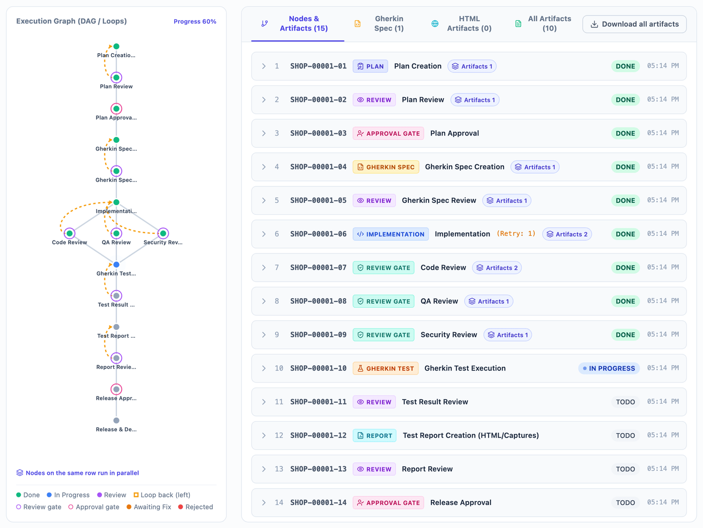
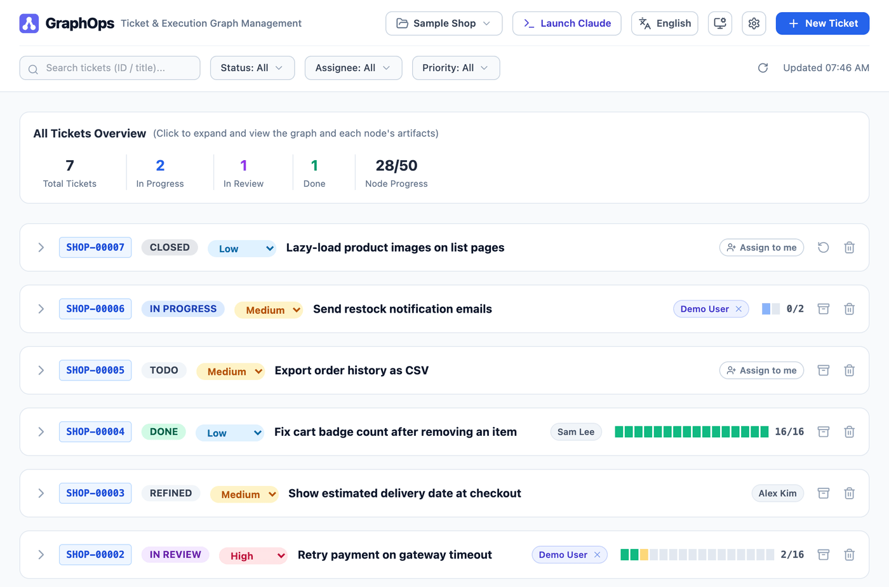
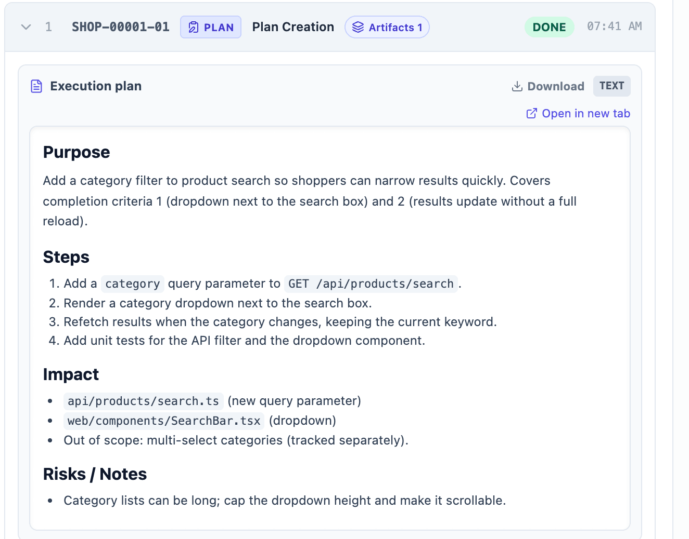
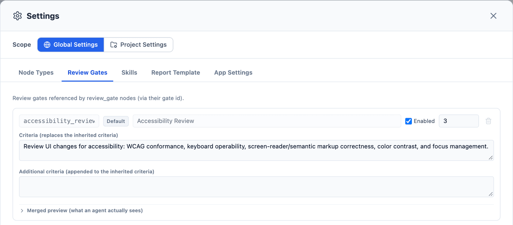

# GraphOps

[English](#english) | [日本語](#japanese)

<a id="english"></a>
## English

GraphOps is a ticket management and execution platform for AI-driven development, built around execution graphs (DAG / parallel / loops). You install it as a Claude Code plugin and use it through slash commands and a local Web UI. No local build is required.



> The screenshots in this README show the Web UI in English with sample data. You can switch the UI language (English / 日本語) from the header.

### What GraphOps Does

- **One execution graph per ticket**: each ticket gets a DAG of nodes such as `plan`, `review`, `gherkin_spec`, `implementation`, `review_gate`, `approval_gate`, `report`, and `release`. Nodes run in order or in parallel according to their dependencies. When a review fails, the graph loops back to the node that needs rework.
- **Review gates and approval gates**: a `review_gate` node judges pass/fail automatically against configurable criteria (code, QA, security, non-functional, ...). An `approval_gate` node always waits for a human decision, made either in the terminal running `/graph-ops:process-ticket` or in the Web UI.
- **Web UI**: a ticket list with search, filters, and paging; an interactive view of each ticket's execution graph; formatted previews of every artifact (Markdown, Gherkin, HTML); approve/reject buttons; and buttons that launch Claude Code for you.
- **Customizable without editing the plugin**: node-type instructions, review-gate criteria, skill instructions, and the plan / review / report templates can be extended globally (per user) or per project (shared with your team), from the Web UI's Settings screen.

### Requirements

- [Claude Code](https://docs.claude.com/en/docs/claude-code)
- `git` and `node` on your `PATH`, and network access for the first install (Claude Code fetches the plugin with `git`; on first use the plugin runs `node` to download the `graph-engine` binary)
- macOS (Apple silicon / Intel), Linux (x86_64), or Windows (x86_64)

### Installation & Getting Started

#### Install

Run the following inside Claude Code:
```
/plugin marketplace add imahiro-t/graph-ops
/plugin install graph-ops@graph-ops
```
Installing fetches the plugin at the current release tag. The first time the plugin runs `graph-engine`, it downloads the binary for your OS/architecture from that release's GitHub Release, checks it against the release's `checksums.txt`, and stores it in a per-user cache (`~/.cache/graph-ops/engine/`). Later runs reuse the cache.

#### Quick start

1. **Choose the plugin's language**: run `/graph-ops:onboarding` once. It asks which language the plugin should use for node names and generated content (plans, Gherkin specs, implementation notes, review results, reports). You can re-run it any time.
2. **Register your project**: `cd` into your project's working directory, start Claude Code, and run `/graph-ops:ui`. The Web UI opens in your browser. If no project is mapped to that directory in your environment yet, a dialog opens where you either **create a new project** or **choose an existing project** from the database (for example, one a teammate sharing the same MySQL database already created). Either way, the mapping from that directory to the project is saved to your local `graph-config.json`.
3. **Create a ticket**: run `/graph-ops:create-ticket` and describe what you want. Claude talks the request through with you (scope, affected areas, edge cases) before it registers the ticket. You can also start from the Web UI's "New Ticket" button.
4. **Refine the ticket (optional)**: run `/graph-ops:refine-ticket` to pin down the completion criteria and the "why". The ticket's description is rewritten around them.
5. **Run the ticket**: run `/graph-ops:process-ticket` (or press "Run" on the ticket in the Web UI). It builds the execution graph, runs each node with a subagent (in parallel where possible), saves artifacts, and repeats reviews until they pass.
6. **Follow progress in the Web UI**: open it any time with `/graph-ops:ui` to see the graph, read artifacts, and approve or reject approval gates.

#### Updating to a new release

Update from the `/plugin` menu, or run the following in a terminal:
```sh
claude plugin update graph-ops@graph-ops
```
Each release points the marketplace entry at the new release tag, so updating fetches that release. The first run after the update downloads the matching `graph-engine` binary. You don't need to uninstall or reinstall.
- **If you installed version 0.4.0 or earlier**: those versions were fetched by a `node` one-liner that kept a clone of the repository per release under `~/.cache/graph-ops/` (for example `~/.cache/graph-ops/v0.4.0`). The plugin no longer uses those clones, so you can delete the `v*` directories there. Leave `~/.cache/graph-ops/engine/`, which holds the downloaded binaries.

### Commands

| Command | What it does |
| --- | --- |
| `/graph-ops:onboarding` | First-time setup. Asks which language the plugin should work in and saves the choice. |
| `/graph-ops:create-ticket` | Talks a request through with you, then creates a ticket (optionally with labels already registered for the project). Does not build an execution graph. |
| `/graph-ops:refine-ticket` | Pins down a ticket's completion criteria and "why", and rewrites its description (and, if needed, its priority and labels). Does not build an execution graph. |
| `/graph-ops:process-ticket` | Decides the shape of the ticket's execution graph, then runs it with subagents, saving artifacts and repeating reviews until they converge. |
| `/graph-ops:ui` | Opens the local Web UI for the project whose local path is (or contains) the current directory, starting the UI server if needed. If none matches, lets you create a new project or choose an existing one for this directory. |

### Using the Web UI

#### Projects

Switch between registered projects from the project menu in the header. Choose "New project..." to register another one (name, optional ID prefix, and optionally its local path as an absolute path). Tickets and their IDs (for example `SHOP-00001`) belong to a project.

A project itself (name, prefix, tickets) lives in the database and can be shared by a team, but its **local path** -- where the project is checked out on your machine -- is a per-environment setting. It is stored in your own `graph-config.json` under `projectPaths` (project ID -> absolute path), never in the database, so every member sharing one database sets their own path without affecting anyone else. The local path is what `/graph-ops:ui` and `create-ticket` match the current directory against (the deepest local path containing the directory wins, so git worktrees under the project resolve to it), the directory Claude Code is launched in, and where the project's team settings (`.graph-ops/`) are read from. A project with no local path in your environment still works: launches fall back to the default terminal directory, and "Project Settings" asks you to set the path first.

#### Ticket list



- "All Tickets Overview" shows the total number of tickets, how many are in progress, in review, and done, and the node progress.
- Search by ticket ID or title, filter by status, assignee, priority, and label, and page through the list.
- The four filters all work the same way: nothing selected means "All" (no filtering), and selecting several options within one filter shows the tickets that match any of them, while different filters narrow the list together. "Clear selection" at the bottom of a panel empties that filter back to All. The assignee filter takes several assignees too, and its "Unassigned" option narrows the list to tickets with nobody assigned.
- A ticket's status (`TODO` / `REFINED` / `IN PROGRESS` / `IN REVIEW` / `IN RELEASE` / `DONE` / `CLOSED`) is derived automatically from its execution graph.
- You can change a ticket's priority, assign it to yourself with "Assign to me", close it without completing it (with an optional reason), reopen it, or delete it (after a confirmation).
- "Assign to me" appears once you set your name under Settings > App Settings > "My Profile".
- Tickets can carry several labels (for example "Bug" or "Feature"), shown as colored chips on the ticket row and in the expanded ticket. Add or remove them with "Edit labels" on an expanded ticket; only labels registered for the project (see "Labels" under Settings) can be chosen.

#### Execution graph and artifacts

Click a ticket to expand it. The left side shows the execution graph: nodes on the same row run in parallel, dashed lines are loop-back edges for rework, and rings mark review gates and approval gates. The right side lists the nodes with their status and retry count.



- Click a node to preview its artifacts: Markdown, Gherkin, and HTML are shown formatted.
- Each artifact can be opened in a new tab or downloaded. "Download all artifacts" downloads every artifact of the ticket at once.
- The "Gherkin Spec", "HTML Artifacts", and "All Artifacts" tabs collect artifacts of each kind across the ticket.

#### Approving and rejecting

When a ticket reaches a pending `approval_gate`, open the ticket: "Approve" and "Reject" buttons appear on that node's row. Rejecting requires a reason.

You can also answer in the terminal instead. When `/graph-ops:process-ticket` reaches the gate, it tells you what is being approved, starts `graph-engine wait-node` in the background to watch the gate, and ends its turn. Reply approve or reject (with a reason) in that terminal, or use the Web UI buttons. A decision made in the Web UI resumes the waiting session automatically: an approval continues the graph, and a rejection goes straight to triage, where process-ticket reads the rejection reason and reopens the nodes that need rework (or reports back when the reason calls for rethinking the requirements).

If no process-ticket session is waiting at the gate (for example, the terminal was closed), the Web UI decision is only recorded. The graph continues, or the rejection is triaged, the next time you run `/graph-ops:process-ticket` on the ticket. Until then, a rejected ticket stays blocked unless a person resolves it.

#### Launching Claude Code

The following buttons open an external, interactive terminal running `claude`. You handle permission prompts and any further conversation in that terminal.

- "Launch Claude" in the header opens a dialog where you can type any prompt and press "Launch".
- "New Ticket" in the header opens a form with a single field where you describe the ticket you want. "Create" starts `claude`, which works out the title and description with the create-ticket skill and asks you to confirm them before creating the ticket.
- "Refine" and "Run" on an expanded ticket start `claude` to refine or run that ticket.
- The prompt box on an expanded ticket sends any instruction about that ticket with "Send".

The prompt fields accept multiple lines: press Enter for a new line, and press "Launch"/"Send"/"Create" or Cmd+Enter (macOS) / Ctrl+Enter to submit. A prompt with only spaces or blank lines is not sent.

#### Settings



Open Settings with the gear button in the header.

- **Scope**: "Global Settings" apply to you on every project (stored in `$HOME/.graph-ops` by default). "Project Settings" apply to one project and are stored in the `.graph-ops/` directory of its local path, so you can commit and share them with your team. Project settings take precedence over global settings. Editing "Project Settings" requires the project's local path to be set in your environment. `$HOME/.graph-ops` is always the global settings directory and is never used as a project's settings directory, so a project whose local path is your home directory itself has no project settings.
- **Node Types / Review Gates / Skills / Templates**: add instructions for each node type, change or add review-gate criteria, add instructions to each skill, and replace the execution-plan, review, and HTML report templates (the Templates tab's left-hand list switches between the three). Each screen also shows a merged preview of what an agent actually sees.
- **Labels** (Project Settings only): create labels for the selected project, rename them, pick each one's color from a fixed palette, and delete them. Label names must be unique within a project (ignoring letter case). Labels are stored in the database, not in `.graph-ops/`, so changes are saved immediately, shared with everyone using the same database, and reflected on every ticket that carries the label; this tab does not need the project's local path. Deleting a label that is in use asks for confirmation with the number of tickets using it, then removes it from all of them. The CLI (`graph-engine create-ticket` / `refine-ticket --label <name>`) can only attach labels that are already registered here.
- **App Settings** (Global Settings only): data storage (SQLite database file or MySQL connection, including TLS), "My Profile" (your name for "Assign to me"), the number of tickets per page, the node/workflow config directory, and project management (rename a project, check / set / change / clear its local path for this environment -- shown as "Not set" when there is none -- or delete it). Storage changes take effect the next time the server starts. The defaults work as they are, so most users don't need to change anything here.

#### Theme and language

Use the header buttons to switch the theme (light / dark / match system) and the Web UI language (English / 日本語).

### Notes

- **Local, single-user tool**: the Web UI has no login. By default, the server listens only on `127.0.0.1` (port `49173`). To change this, set `host` / `port` in `graph-config.json`, or the `GRAPH_HOST` / `PORT` environment variables. Only open it to other machines on a network you trust.
- **Where data is stored**: tickets, execution graphs, and artifacts are stored in a database, by default the SQLite file `$HOME/.graph-ops/graph.db`. `$HOME/.graph-ops/artifacts` is a working-files directory for investigation material and temporary files. When an HTML or image artifact is registered from a file path, only files under this directory can be read. If an `artifacts/` directory appears at the root of your repository, it is stray output and safe to delete.
- **Configuration file**: runtime settings are read from `graph-config.json` in the directory the server or CLI starts from, or else from `$HOME/.graph-ops/config.json`. App Settings writes to that same file. Environment variables take precedence over the file. The file also holds `projectPaths`, each project's local path in this environment; it is saved to whichever `graph-config.json` the server (or CLI) in use reads, so start them from places that resolve to the same file.
- **Upgrading from a version that stored `work_dir` in the database**: the `projects.work_dir` column is dropped automatically (SQLite and MySQL) the first time the new version opens the database (the UI server or any `graph-engine` command that uses it), and its values are **not** migrated. First stop or restart any UI server started before the update (one you ran with `graph-engine serve`, or one `/graph-ops:ui` started in the background): `/graph-ops:ui` reuses a server that is already running, so an old server keeps serving until you stop it. On macOS / Linux, `kill $(lsof -ti tcp:49173 -sTCP:LISTEN)` stops it (replace `49173`, the default port, if you changed it), and the next `/graph-ops:ui` starts the new one. If you leave the old server running, it does not report projects' local paths, so `/graph-ops:ui` never finds the project for your directory and opens the old project creation form every time; and once the column is gone, the old server fails with SQL errors when it lists or creates projects. Set each project's local path again, from App Settings > project management or by running `/graph-ops:ui` in the project directory and choosing the existing project. If your team shares a MySQL database, upgrade everyone together: an older binary cannot create or read projects once the column is gone. API change: project responses no longer contain `work_dir`; they contain `local_path` (this environment's path, `""` when not set) instead, and `POST` / `PATCH /api/projects` accept `local_path`.
- **Labels on an existing database**: the label tables are created automatically (SQLite and MySQL) the first time the new version opens the database. Existing tickets are left unchanged and start with no labels.
- **Two separate language settings**: `/graph-ops:onboarding` sets the language of the content the plugin generates (saved as `language:` in `$HOME/.graph-ops/config.yaml`). The header's language button only changes the Web UI's display language.

### Troubleshooting

- **The plugin update fails or stays on the old release, saying the command changed since install**: your installed copy came from the old fetch command (version 0.4.0 or earlier). Run `claude plugin update graph-ops@graph-ops` in a regular terminal; if it asks you to approve a command, approve it once. From then on, updates need no approval (see "Updating to a new release").
- **A button that launches Claude Code doesn't seem to open a terminal**: GraphOps picks the terminal automatically, in this order: a `terminalCommand` you configured; a new window in the current `tmux` session; Terminal.app on macOS; Windows Terminal (`wt.exe`) or, if it isn't installed, a PowerShell window on Windows. If none applies (for example on Linux outside `tmux`), the launch fails and a short error message appears in the Web UI and disappears after a few seconds. Set `terminalCommand` in `graph-config.json` (or the `TERMINAL_COMMAND` environment variable) to a shell command template that uses the `{cwd}` and `{command}` placeholders. For example, with WezTerm:
  ```json
  { "terminalCommand": "wezterm start --cwd {cwd} -- {command}" }
  ```
  The same setting lets you use a terminal that auto-detection doesn't cover, such as iTerm2, kitty, or the VS Code integrated terminal.

---

<a id="japanese"></a>
## 日本語

GraphOps は、実行グラフ（DAG／並列／ループ）を軸にした、AI 駆動開発向けのチケット管理・実行基盤です。Claude Code のプラグインとしてインストールし、スラッシュコマンドとローカルの Web UI で操作します。手元でのビルドは不要です。


> この README のスクリーンショットは、サンプルデータを使った英語表示の Web UI です。UI の表示言語（English／日本語）はヘッダーから切り替えられます。

### GraphOps でできること

- **チケットごとの実行グラフ**: チケットごとに、`plan`／`review`／`gherkin_spec`／`implementation`／`review_gate`／`approval_gate`／`report`／`release` などのノードから成る DAG を持ちます。ノードは依存関係に従って直列・並列に実行されます。レビューに落ちると、手直しが必要なノードへ差し戻し（ループ）ます。
- **レビューゲートと承認ゲート**: `review_gate` ノードは、設定した観点（コード、QA、セキュリティ、非機能など）で自動的に合否を判定します。`approval_gate` ノードは、必ず人間の判断を待ちます。判断は、`/graph-ops:process-ticket` を実行中のターミナルでも Web UI でもできます。
- **Web UI**: 検索・フィルタ・ページングに対応したチケット一覧、チケットごとの実行グラフのインタラクティブな表示、すべての成果物（Markdown／Gherkin／HTML）の整形プレビュー、承認・却下ボタン、Claude Code を起動するボタンを備えています。
- **プラグインを編集せずにカスタマイズ**: ノード種別ごとの指示、レビューゲートの観点、スキルへの指示、レポートテンプレートを、全体（ユーザーごと）またはプロジェクト単位（チームで共有）で拡張できます。Web UI の設定画面から編集します。

### 必要なもの

- [Claude Code](https://docs.claude.com/en/docs/claude-code)
- `PATH` 上の `git` と `node`、および初回インストール時のネットワーク接続（Claude Code がプラグインを `git` で取得し、プラグインは初回利用時に `node` で `graph-engine` バイナリをダウンロードします）
- macOS（Apple シリコン／Intel）、Linux（x86_64）、Windows（x86_64）

### インストールと使い始め方

#### インストール

Claude Code 内で次を実行します。
```
/plugin marketplace add imahiro-t/graph-ops
/plugin install graph-ops@graph-ops
```
インストールすると、現在のリリースタグのプラグインが取得されます。プラグインが初めて `graph-engine` を実行するときに、お使いの OS／アーキテクチャ向けのバイナリをそのリリースの GitHub Release からダウンロードし、リリースの `checksums.txt` と照合してから、ユーザーごとのキャッシュ（`~/.cache/graph-ops/engine/`）に保存します。2 回目以降はこのキャッシュを使います。

#### クイックスタート

1. **プラグインの言語を選ぶ**: `/graph-ops:onboarding` を一度実行します。ノード名や生成される内容（計画、Gherkin 仕様、実装メモ、レビュー結果、レポート）に使う言語を聞かれます。いつでも再実行できます。
2. **プロジェクトを登録する**: プロジェクトの作業ディレクトリに `cd` して Claude Code を起動し、`/graph-ops:ui` を実行します。ブラウザで Web UI が開きます。自分の環境でそのディレクトリに対応するプロジェクトがまだなければ、ダイアログで「**新規作成**」するか、DB にある「**既存プロジェクトから選ぶ**」（同じ MySQL を使うメンバーがすでに作ったプロジェクトなど）を選べます。どちらを選んでも、そのディレクトリとプロジェクトの対応が自分の `graph-config.json` に保存されます。
3. **チケットを作る**: `/graph-ops:create-ticket` を実行し、やりたいことを伝えます。Claude が範囲・影響箇所・エッジケースなどを対話で詰めてから、チケットを登録します。Web UI の「新規チケット」ボタンから始めることもできます。
4. **チケットをリファインする（任意）**: `/graph-ops:refine-ticket` を実行すると、完了条件と「なぜやるか」を固め、その内容でチケットの説明を書き直します。
5. **チケットを実行する**: `/graph-ops:process-ticket` を実行します（Web UI のチケットの「実行する」ボタンでも可）。実行グラフを組み立て、ノードごとにサブエージェントで（可能なところは並列に）作業し、成果物を保存し、レビューが通るまで繰り返します。
6. **Web UI で進捗を確認する**: `/graph-ops:ui` でいつでも開けます。グラフの確認、成果物の閲覧、承認ゲートの承認・却下ができます。

#### 新しいリリースへの更新

`/plugin` メニューから更新するか、ターミナルで次を実行します。
```sh
claude plugin update graph-ops@graph-ops
```
リリースのたびにマーケットプレイスの登録内容が新しいリリースタグを指すので、更新するとそのリリースが取得されます。更新後の初回実行時に、対応する `graph-engine` バイナリがダウンロードされます。アンインストールや再インストールは不要です。
- **バージョン 0.4.0 以前をインストールしていた場合**: これらのバージョンは `node` のワンライナーで取得され、リリースごとにリポジトリのクローンを `~/.cache/graph-ops/` の下（例: `~/.cache/graph-ops/v0.4.0`）に残していました。現在のプラグインはこれらを使わないので、そこにある `v*` ディレクトリは削除してかまいません。ダウンロード済みのバイナリが入っている `~/.cache/graph-ops/engine/` は残してください。

### コマンド一覧

| コマンド | 役割 |
| --- | --- |
| `/graph-ops:onboarding` | 初回セットアップ。プラグインが使う言語を確認し、設定として保存します。 |
| `/graph-ops:create-ticket` | 依頼内容を対話で詰めてから、チケットを作成します（プロジェクトに登録済みのラベルも付けられます）。実行グラフは作りません。 |
| `/graph-ops:refine-ticket` | チケットの完了条件と「なぜやるか」を固め、説明を書き直します（必要なら優先度とラベルも変更します）。実行グラフは作りません。 |
| `/graph-ops:process-ticket` | チケットの実行グラフの形を決め、サブエージェントで実行します。成果物の保存と、レビューが収束するまでの繰り返しも行います。 |
| `/graph-ops:ui` | カレントディレクトリがローカルパス（またはその配下）にあたるプロジェクトのローカル Web UI を開きます。必要なら UI サーバーを起動します。該当がなければ、このディレクトリ用にプロジェクトを新規作成するか既存プロジェクトを選べます。 |

### Web UI の使い方

#### プロジェクト

ヘッダーのプロジェクトメニューで、登録済みのプロジェクトを切り替えます。「新規プロジェクト...」から別のプロジェクトを登録できます（名前、任意の ID プレフィックス、任意でローカルパスの絶対パス）。チケットとその ID（例: `SHOP-00001`）はプロジェクトに属します。

プロジェクト本体（名前・プレフィックス・チケット）は DB にあり、チームで共有できます。一方、**ローカルパス**（自分のマシン上でプロジェクトがある場所）は環境ごとの設定です。DB ではなく自分の `graph-config.json` の `projectPaths`（プロジェクト ID → 絶対パス）に保存されるので、同じ DB を使うメンバーがそれぞれ自分のパスを設定しても互いに影響しません。ローカルパスは、`/graph-ops:ui` や `create-ticket` がカレントディレクトリと照合する対象（ディレクトリを含むローカルパスのうち一番深いものが優先されるので、プロジェクト配下の git worktree もそのプロジェクトになります）、Claude Code を起動するディレクトリ、プロジェクトのチーム用設定（`.graph-ops/`）の読み込み元として使われます。自分の環境でローカルパスが未設定のプロジェクトも使えます。起動は既定のターミナル用ディレクトリで行われ、「プロジェクト単位設定」は先にパスの設定を促します。

#### チケット一覧


- 「全チケット概要」に、総チケット数、進行中・レビュー中・完了の件数、ノード進捗が表示されます。
- チケット ID やタイトルで検索し、ステータス・担当者・優先度・ラベルで絞り込み、ページを切り替えられます。
- 4つの絞り込みはどれも同じ操作です。何も選んでいない状態が「すべて」（絞り込みなし）で、同じ絞り込みの中で複数選ぶと、そのいずれかに一致するチケットが表示されます。異なる絞り込みどうしは、すべてに一致するチケットに絞られます。パネル下部の「選択を解除」を押すと、その絞り込みの選択が空（＝すべて）に戻ります。担当者も複数選べ、「未割り当て」を選ぶと担当者が未設定のチケットだけに絞り込めます。
- チケットのステータス（`TODO`／`REFINED`／`IN PROGRESS`／`IN REVIEW`／`IN RELEASE`／`DONE`／`CLOSED`）は、実行グラフから自動的に決まります。
- チケットの優先度の変更、「担当する」での自分への割り当て、完了せずにクローズ（理由は任意）、再オープン、削除（確認あり）ができます。
- 「担当する」ボタンは、設定 > アプリ設定 > 「自分の情報」で名前を設定すると表示されます。
- チケットには複数のラベル（「バグ」「機能追加」など）を付けられ、チケットの行と展開したチケットに色付きで表示されます。付け外しは、展開したチケットの「ラベルを編集」で行います。選べるのは、そのプロジェクトに登録済みのラベル（設定の「ラベル」を参照）だけです。

#### 実行グラフと成果物

チケットをクリックすると展開されます。左側は実行グラフです。同じ行のノードは並列に実行され、破線は手直しのための差し戻し辺、リングはレビューゲートと承認ゲートを表します。右側にはノードの一覧が、ステータスと再実行回数とともに表示されます。


- ノードをクリックすると成果物をプレビューできます。Markdown・Gherkin・HTML は整形して表示されます。
- 成果物ごとに「別タブで開く」「ダウンロード」ができます。「成果物を一括ダウンロード」で、チケットのすべての成果物をまとめてダウンロードできます。
- 「Gherkin 仕様」「HTML 成果物」「全成果物」タブには、チケット全体の成果物が種類ごとにまとまっています。

#### 承認と却下

チケットが承認待ちの `approval_gate` に達したら、チケットを開きます。そのノードの行に「承認」「却下」ボタンが表示されます。却下には理由の入力が必要です。

ターミナルで回答することもできます。`/graph-ops:process-ticket` はゲートに達すると、何を承認するのかを伝え、ゲートを見張る `graph-engine wait-node` をバックグラウンドで起動して、ターンを終えます。そのターミナルで承認か却下（理由付き）を答えるか、Web UI のボタンを使います。Web UI で判断すると、待機中のセッションが自動で再開します。承認ならグラフの実行を続けます。却下なら process-ticket が却下理由を読み、手直しが必要なノードを再開します（要件から考え直す必要がある理由なら、ユーザーに報告します）。

ゲートで待機中の process-ticket セッションがない場合（ターミナルを閉じた場合など）、Web UI での判断は記録されるだけです。次にそのチケットで `/graph-ops:process-ticket` を実行したときに、グラフの実行が続くか、却下が処理されます。それまで、却下されたチケットは、人が解決しない限りブロックされたままです。

#### Claude Code の起動

次のボタンは、`claude` を実行する外部の対話型ターミナルを開きます。権限の確認やその後のやり取りは、そのターミナルで行います。

- ヘッダーの「Claude 起動」は、任意のプロンプトを入力して「起動」を押すダイアログを開きます。
- ヘッダーの「新規チケット」は、作成したいチケットの内容を書く入力欄 1 つのフォームを開きます。「作成」を押すと `claude` が起動し、create-ticket スキルでタイトルと説明を考え、確認を取ってからチケットを登録します。
- 展開したチケットの「リファイン」「実行する」は、そのチケットのリファインや実行のために `claude` を起動します。
- 展開したチケットのプロンプト欄からは、そのチケットに関する任意の指示を「送信」で送れます。

プロンプト欄は複数行に対応しています。Enter で改行し、「起動」／「送信」／「作成」ボタンか、Cmd+Enter（macOS）／Ctrl+Enter で送信します。空白や空行だけのプロンプトは送信されません。

#### 設定


ヘッダーの歯車ボタンで設定画面を開きます。

- **スコープ**: 「全体設定」は、すべてのプロジェクトで自分に適用されます（既定の保存先は `$HOME/.graph-ops`）。「プロジェクト単位設定」は 1 つのプロジェクトに適用され、そのローカルパスの `.graph-ops/` ディレクトリに保存されるので、コミットしてチームで共有できます。プロジェクト単位設定は全体設定より優先されます。「プロジェクト単位設定」を編集するには、自分の環境でそのプロジェクトのローカルパスが設定されている必要があります。`$HOME/.graph-ops` は常に全体設定の保存先で、プロジェクト単位設定の保存先としては使われません。そのため、ローカルパスがホームディレクトリそのものであるプロジェクトには、プロジェクト単位設定がありません。
- **ノード種別／レビューゲート／スキル／レポートテンプレート**: ノード種別ごとの指示の追加、レビューゲートの観点の変更・追加、スキルごとの指示の追加、HTML レポートテンプレートの差し替えができます。どの画面にも、エージェントが実際に受け取る内容のマージ済みプレビューがあります。
- **ラベル**（プロジェクト単位設定のみ）: 選択中のプロジェクトのラベルを作成し、名前の変更、固定パレットからの色の選択、削除ができます。ラベル名はプロジェクト内で重複できません（大文字小文字は区別しません）。ラベルは `.graph-ops/` ではなく DB に保存されるので、変更はすぐに保存されて同じ DB を使う全員で共有され、そのラベルが付いたすべてのチケットの表示に反映されます。このタブはプロジェクトのローカルパスが未設定でも使えます。使用中のラベルを削除するときは、使用しているチケットの件数付きで確認が表示され、確定するとすべてのチケットから外れます。CLI（`graph-engine create-ticket`／`refine-ticket` の `--label <name>`）で付けられるのは、ここで登録済みのラベルだけです。
- **アプリ設定**（全体設定のみ）: データ保存先（SQLite のデータベースファイル、または TLS 設定を含む MySQL 接続）、「自分の情報」（「担当する」に使う名前）、1 ページあたりのチケット数、ノード／ワークフロー設定ディレクトリ、プロジェクト管理（名前の変更、この環境でのローカルパスの確認・設定・変更・クリア（未設定なら「未設定」と表示）、削除）。保存先の変更は、次にサーバーを起動したときに反映されます。既定値のままで動くので、ほとんどの場合は変更不要です。

#### テーマと言語

ヘッダーのボタンで、テーマ（ライト／ダーク／システム設定に合わせる）と Web UI の表示言語（English／日本語）を切り替えます。

### 補足

- **ローカル・単一ユーザー向けのツール**: Web UI にログインはありません。既定では、サーバーは `127.0.0.1`（ポート `49173`）でのみ待ち受けます。変更するには、`graph-config.json` の `host`／`port`、または環境変数 `GRAPH_HOST`／`PORT` を設定します。他のマシンに公開するのは、信頼できるネットワークの中だけにしてください。
- **データの保存先**: チケット・実行グラフ・成果物はデータベースに保存されます。既定は SQLite ファイル `$HOME/.graph-ops/graph.db` です。`$HOME/.graph-ops/artifacts` は、調査資料や一時ファイルを置く作業ファイル置き場です。HTML や画像の成果物をファイルパスで登録するときは、このディレクトリ配下のファイルだけを読み込めます。リポジトリ直下に `artifacts/` ディレクトリができていたら、紛れ込んだ不要な出力なので削除してかまいません。
- **設定ファイル**: 実行時の設定は、サーバーや CLI を起動したディレクトリの `graph-config.json`、なければ `$HOME/.graph-ops/config.json` から読み込まれます。アプリ設定もこのファイルに書き込みます。環境変数はファイルより優先されます。このファイルには、この環境での各プロジェクトのローカルパス `projectPaths` も入ります。使っているサーバー（または CLI）が読む `graph-config.json` に保存されるので、両者が同じファイルを読む場所から起動してください。
- **DB に `work_dir` を保存していたバージョンからのアップグレード**: 新しいバージョンが初めて DB を開いたとき（UI サーバーでも、DB を使う `graph-engine` のコマンドでも）に `projects.work_dir` カラムが自動で削除されます（SQLite・MySQL とも）。既存の値は**移行されません**。まず、更新前に起動した UI サーバー（`graph-engine serve` で起動したもの、または `/graph-ops:ui` がバックグラウンドで起動したもの）が動いていれば、停止または再起動してください。`/graph-ops:ui` は起動済みのサーバーをそのまま使うため、止めない限り古いサーバーが動き続けます。macOS／Linux では `kill $(lsof -ti tcp:49173 -sTCP:LISTEN)` で停止できます（`49173` は既定のポートです。変更している場合は置き換えてください）。次に `/graph-ops:ui` を実行すると新しいサーバーが起動します。古いサーバーを動かしたままにすると、プロジェクトのローカルパスを返さないため、`/graph-ops:ui` はディレクトリに対応するプロジェクトを特定できず、毎回古いプロジェクト作成フォームを開きます。さらにカラムの削除後は、古いサーバーでのプロジェクトの取得・作成が SQL エラーになります。各プロジェクトのローカルパスは、アプリ設定のプロジェクト管理か、プロジェクトのディレクトリで `/graph-ops:ui` を実行して既存プロジェクトを選ぶことで、各自が設定し直してください。チームで MySQL を共有している場合は、全員そろってアップグレードしてください。カラム削除後は、古いバイナリではプロジェクトの作成や取得ができません。API の変更点: プロジェクトの応答から `work_dir` がなくなり、代わりに `local_path`（この環境でのパス。未設定なら `""`）が入ります。`POST`／`PATCH /api/projects` は `local_path` を受け付けます。
- **既存 DB のラベル対応**: 新しいバージョンが初めて DB を開いたときに、ラベル用のテーブルが自動で作成されます（SQLite・MySQL とも）。既存のチケットは変更されず、ラベルなしの状態になります。
- **2 種類の言語設定**: `/graph-ops:onboarding` は、プラグインが生成する内容の言語を設定します（`$HOME/.graph-ops/config.yaml` に `language:` として保存）。ヘッダーの言語ボタンは、Web UI の表示言語だけを切り替えます。

### トラブルシューティング

- **プラグインの更新が「インストール時からコマンドが変わった」として失敗する、または古いリリースのままになる**: インストール済みのプラグインが、以前の取得コマンド（バージョン 0.4.0 以前）で入ったものです。通常のターミナルで `claude plugin update graph-ops@graph-ops` を実行し、コマンドの承認を求められたら一度だけ承認してください。以降の更新では承認は不要です（「新しいリリースへの更新」を参照）。
- **Claude Code を起動するボタンを押してもターミナルが開かないように見える**: GraphOps は次の順にターミナルを自動で選びます。設定済みの `terminalCommand`、実行中の `tmux` セッションの新しいウィンドウ、macOS の Terminal.app、Windows の Windows Terminal（`wt.exe`。未インストールなら PowerShell のウィンドウ）です。どれにも当てはまらない場合（Linux で `tmux` を使っていない場合など）は起動に失敗し、Web UI に短いエラーメッセージが表示され、数秒で消えます。`graph-config.json` の `terminalCommand`（または環境変数 `TERMINAL_COMMAND`）に、`{cwd}` と `{command}` のプレースホルダーを使ったシェルコマンドのテンプレートを設定してください。例えば WezTerm の場合:
  ```json
  { "terminalCommand": "wezterm start --cwd {cwd} -- {command}" }
  ```
  同じ設定で、自動判定の対象外のターミナル（iTerm2、kitty、VS Code の統合ターミナルなど）も使えます。

---

## License

MIT License. See [LICENSE](./LICENSE).

Copyright (c) 2026 Takashi Imahiro

## ライセンス

MIT ライセンスです。全文は [LICENSE](./LICENSE) を参照してください。

Copyright (c) 2026 Takashi Imahiro
